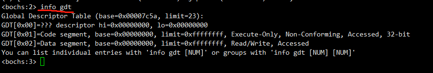
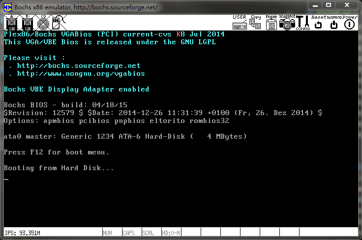

# Lab1-1

## 前言
MIT6.828的lab已经把整个框架搭建好了，你甚至不需要知道如何制作引导盘，直接按照实验手册一键`make`就OK了，完全没有从零开始写一个 OS 的乐趣。而且6.828使用的汇编语言是 AT&T 格式，还有大量可读性极差的GNU内联汇编，我很不喜欢，所以我决定使用 Intel 格式汇编重写相关部分。

下面我将根据我编写[libertyOS](http://github.com/l-iberty/libertyOS)积累的经验，从零开始搭建6.828的JOS。

## 工具
除了6.828实验指导里要求安装的工具外，还需要汇编器nasm和虚拟机bochs (bochs调试OS时你可以查看`GDT`、`CR0`、`CR3`等无法在gdb远程调试时查看的内容)。

安装nasm:
```sh
$ sudo apt-get install nasm
```

安装bochs:
- 下载：[https://bochs.sourceforge.io/](https://bochs.sourceforge.io/)，我使用的版本是2.6.8
- 安装bochs依赖：
```sh
$ sudo apt-get install -y libx11-dev libxrandr-dev xorg-dev libgtk2.0-dev
```
- 编译安装：
```sh
$ tar zxf bochs-2.6.8.tar.gz
$ cd bochs-2.6.8
$ ./configure --enable-debugger --enable-disasm
$ make
$ sudo make install
```

## 启动盘的制作
### 编译
- `boot/boot.asm`
按照 NASM 汇编语法把6.828的`boot/boot.S`抄过来 -> `boot/boot.asm`。要点：
1. 导出`boot/boot.asm`的代码段入口`start`供链接器识别：`global start`
2. 导入位于`boot/main.c`外部符号`bootmain`：`extern bootmain`
3. 编译为ELF二进制文件`obj/boot/boot.o`

- `boot/main.c`
写一个函数`bootmain`，函数体先空着。编译为i386架构的ELF二进制文件`obj/boot/main.o`

### 链接
把`obj/boot/boot.o`和`obj/boot/main.o`链接成`obj/boot/boot.out`。链接器选项：
1. `-m elf_i386`：i386架构的ELF
2. `-N`：Set the text and data sections to be readable and writable.
3. `-e start`：代码段入口为`boot/boot.asm`导出的`start`
4. `-Ttext 0x7C00`：`0x7C00`是加载引导扇区的物理基地址，PC会从这里开始执行引导代码，所以需要把`0x7C00`同时作为链接地址(link address, the *entry point* of the program)。

### 引导扇区
我们的目标是制作一个512字节的引导扇区，终结符`0xAA55`告诉PC这是引导扇区。目前，引导扇区的代码位于`obj/boot/boot.out`，需要使用`objcopy`把代码段拷贝出来，保存为`obj/boot/boot`。然后使用6.828提供的脚本`boot/sign.pl`将它填充为512字节，末尾是引导扇区的标志`0xAA55`，如下：
```
00000000: FA FC 31 C0 8E D8 8E C0 8E D0 E4 64 A8 02 75 FA    z|1@.X.@.Pdd(.uz
00000010: B0 D1 E6 64 E4 64 A8 02 75 FA B0 DF E6 60 0F 01    0Qfddd(.uz0_f`..
00000020: 16 72 7C 0F 20 C0 66 83 C8 01 0F 22 C0 66 EA 40    .r|..@f.H.."@fj@
00000030: 7C 00 00 08 00 90 90 90 90 90 90 90 90 90 90 90    |...............
00000040: 66 B8 10 00 8E D8 8E C0 8E E8 8E E0 8E D0 BC 00    f8...X.@.h.`.P<.
00000050: 7C 00 00 E8 20 00 00 00 EB FE 00 00 00 00 00 00    |..h....k~......
00000060: 00 00 FF FF 00 00 00 98 CF 00 FF FF 00 00 00 92    ........O.......
00000070: CF 00 17 00 5A 7C 00 00 55 89 E5 83 EC 08 E8 0D    O...Z|..U.e.l.h.
00000080: 00 00 00 EB FE 66 90 66 90 66 90 66 90 66 90 90    ...k~f.f.f.f.f..
00000090: B4 0C B0 4B BB 4E 80 0B 00 66 89 03 C3 00 00 00    4.0K;N...f..C...
000000a0: 00 00 00 00 00 00 00 00 00 00 00 00 00 00 00 00    ................
000000b0: 00 00 00 00 00 00 00 00 00 00 00 00 00 00 00 00    ................
000000c0: 00 00 00 00 00 00 00 00 00 00 00 00 00 00 00 00    ................
000000d0: 00 00 00 00 00 00 00 00 00 00 00 00 00 00 00 00    ................
000000e0: 00 00 00 00 00 00 00 00 00 00 00 00 00 00 00 00    ................
000000f0: 00 00 00 00 00 00 00 00 00 00 00 00 00 00 00 00    ................
00000100: 00 00 00 00 00 00 00 00 00 00 00 00 00 00 00 00    ................
00000110: 00 00 00 00 00 00 00 00 00 00 00 00 00 00 00 00    ................
00000120: 00 00 00 00 00 00 00 00 00 00 00 00 00 00 00 00    ................
00000130: 00 00 00 00 00 00 00 00 00 00 00 00 00 00 00 00    ................
00000140: 00 00 00 00 00 00 00 00 00 00 00 00 00 00 00 00    ................
00000150: 00 00 00 00 00 00 00 00 00 00 00 00 00 00 00 00    ................
00000160: 00 00 00 00 00 00 00 00 00 00 00 00 00 00 00 00    ................
00000170: 00 00 00 00 00 00 00 00 00 00 00 00 00 00 00 00    ................
00000180: 00 00 00 00 00 00 00 00 00 00 00 00 00 00 00 00    ................
00000190: 00 00 00 00 00 00 00 00 00 00 00 00 00 00 00 00    ................
000001a0: 00 00 00 00 00 00 00 00 00 00 00 00 00 00 00 00    ................
000001b0: 00 00 00 00 00 00 00 00 00 00 00 00 00 00 00 00    ................
000001c0: 00 00 00 00 00 00 00 00 00 00 00 00 00 00 00 00    ................
000001d0: 00 00 00 00 00 00 00 00 00 00 00 00 00 00 00 00    ................
000001e0: 00 00 00 00 00 00 00 00 00 00 00 00 00 00 00 00    ................
000001f0: 00 00 00 00 00 00 00 00 00 00 00 00 00 00 55 AA    ..............U*
```

### 启动盘
JOS将从硬盘启动，所以需要使用`dd`制作一个硬盘映像`obj/boot/boot.img`，再把`obj/boot/boot`拷贝到第一个扇区。参见`boot/Makefile.boot`：
```Makefile
$(OBJDIR)/boot/boot.img: $(OBJDIR)/boot/boot
    dd if=/dev/zero of=$@~ count=10000 2>/dev/null
    dd if=$< of=$@~ conv=notrunc 2>/dev/null
    mv $@~ $
```
首先用0填充一个10000个磁盘块（10000×512字节）的文件`boot.img`，再把准备好的`boot`拷贝进去。这样，`boot.img`就成为了JOS的启动盘，可以用qemu或bochs启动。qemu的启动参数见`Makefile`的`QEMUOPTS`变量，bochs的配置文件是`bochsrc`。

### 留下我们的足迹
当JOS运行到`bootmain`的时候让他在屏幕上打印一个红色的`K`。在`boot/lib.asm`里写一个函数`__lib_putc`并导出：
```
global __lib_putc

__lib_putc:
    mov  ah, 0Ch
    mov  al, 'K'
    mov  ebx, 0B8000h + (80*0+39)*2
    mov  [ebx], ax
    ret
```

接着是`boot/main.c`：
```c
extern void __lib_putc();

void bootmain() {
  __lib_putc();
  for (;;)
    ;
}
```

（编译链接的方式见`Makefile`）

现在你可以按照6.828的实验指导利用qemu-gdb进行单步跟踪，也可以用bochs进行最高权限的调试，例如查看`GDT`：



最后是我们留下的足迹，红色的`K`：


