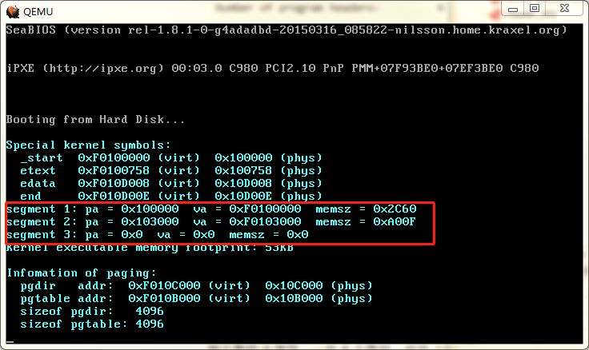
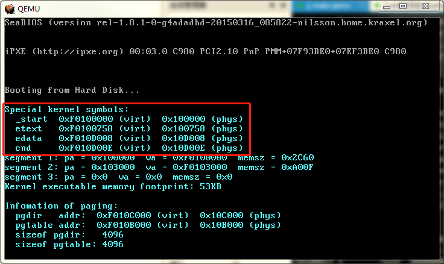

# Lab1-3

## 实现`printf`
深入6.828的`cprintf`实现你会发现，他不仅向CGA显存空间输出，还向串口输出。这是因为6.828要进行测试评分，所以要通过串口把打印在屏幕上的内容输出到虚拟机外面的一个文件里。我实现的`printf`则省去了串口输出。

## virtual memory
与6.828一样，建立一个页表，把虚拟地址`[KERNBASE, KERNBASE+4MB)`映射到物理地址`[0,4MB)`，见`kernel/entrypgdir.c`：
```c
// The entry.S page directory maps the first 4MB of physical memory
// starting at virtual address KERNBASE (that is, it maps virtual
// addresses [KERNBASE, KERNBASE+4MB) to physical addresses [0, 4MB)).
// We choose 4MB because that's how much we can map with one page
// table and it's enough to get us through early boot.  We also map
// virtual addresses [0, 4MB) to physical addresses [0, 4MB); this
// region is critical for a few instructions in entry.S and then we
// never use it again.
//
// Page directories (and page tables), must start on a page boundary,
// hence the "__aligned__" attribute.  Also, because of restrictions
// related to linking and static initializers, we use "x + PTE_P"
// here, rather than the more standard "x | PTE_P".  Everywhere else
// you should use "|" to combine flags
__attribute__((__aligned__(PGSIZE)))
pde_t entry_pgdir[NPDENTRIES] = {
    // Map VA's [0, 4MB) to PA's [0, 4MB)
    [0]
        = ((uintptr_t)entry_pgtable - KERNBASE) + PTE_P,
    // Map VA's [KERNBASE, KERNBASE+4MB) to PA's [0, 4MB)
    [KERNBASE>>PDXSHIFT]
        = ((uintptr_t)entry_pgtable - KERNBASE) + PTE_P + PTE_W
};
```

要点：
1. 为什么是“4MB”？
因为一个页表只能映射这么多，到目前为止4MB内存已经够用了。
2. 设置属性位时为什么使用`x + PTE_P`，而不是更标准的写法`x | PTE_P`？
因为编译器不让：
```
kernel/entrypgdir.c:24:5: error: initializer element is not constant
   = ((uintptr_t)entry_pgtable - KERNBASE) | PTE_P,
     ^
kernel/entrypgdir.c:24:5: note: (near initialization for ‘entry_pgdir[0]’)
kernel/entrypgdir.c:27:5: error: initializer element is not constant
   = ((uintptr_t)entry_pgtable - KERNBASE) | PTE_P | PTE_W
     ^
kernel/entrypgdir.c:27:5: note: (near initialization for ‘entry_pgdir[960]’)
kernel/Makefile:28: recipe for target 'obj/kernel/entrypgdir.o' failed
```
3. 在开启分页后，`[0,4MB)`这块虚拟内存被设置为只读，ring0向这块内存写入。原因是`kernel/entry.asm`通过`cr0`开启了“写保护”。这就导致了一个问题，如何向CGA显存空间`[0xB0000, 0xBFFFF]`写数据，`printf`不能工作了吗？解决方法是将虚拟地址加上`KERNBASE`。虚拟内存`[KERNBASE,KERNBASE+4MB)`是可写的，而它映射到物理内存`[0,4MB)`。所以`kernel/console.c`的`cga_init()`这样初始化`crt_buf`：
```c
crt_buf = (uint16_t *)(CGA_BASE + KERNBASE);
```

**`CR3`的内容？**
`CR3`保存的是页目录的**物理地址**。页目录就是上面提到的`entry_pgdir`。`kernel/entry.asm`导入的`entry_pgdir`这个符号的值是页目录的**虚拟地址**，位于`KERNBASE`之上，是不能直接放进`CR3`的，必须减去`KERNBASE`：
```
	; Load the physical address of entry_pgdir into cr3.  entry_pgdir
	; is defined in entrypgdir.c.
    mov   eax, entry_pgdir
    sub   eax, KERNBASE    ; we need the physical addr of it
    mov   cr3, eax
```

## kernel

## 链接 & 加载
使用6.828提供的脚本`kernel.ld`完成链接。对`kernel.ld`的分析：
```
SECTIONS
{
	/* Link the kernel at this address: "." means the current address */
	. = 0xF0100000;

	/* AT(...) gives the load address of this section, which tells
	   the boot loader where to load the kernel in physical memory */
	.text : AT(0x100000) {
		*(.text .stub .text.* .gnu.linkonce.t.*)
	}

	PROVIDE(etext = .);	/* Define the 'etext' symbol to this value */
```

`0xF0100000`是 kernel 的链接地址(link address)，6.828多次强调其含义：the entry point of the program，代码段的入口地址。注意这是虚拟地址，映射到物理地址`0x100000`，对应后面的“`.text : AT(0x100000)`”。查看 kernel 各个 section 的信息：
```
$ objdump -h obj/kernel/kernel

obj/kernel/kernel:     file format elf32-i386

Sections:
Idx Name          Size      VMA       LMA       File off  Algn
  0 .text         00000703  f0100000  00100000  00001000  2**4
                  CONTENTS, ALLOC, LOAD, READONLY, CODE
  1 .rodata       0000017a  f0100704  00100704  00001704  2**2
                  CONTENTS, ALLOC, LOAD, READONLY, DATA
  2 .stab         00001195  f0100880  00100880  00001880  2**2
                  CONTENTS, ALLOC, LOAD, READONLY, DATA
  3 .stabstr      00000ddc  f0101a15  00101a15  00002a15  2**0
                  CONTENTS, ALLOC, LOAD, READONLY, DATA
  4 .data         0000a008  f0103000  00103000  00004000  2**12
                  CONTENTS, ALLOC, LOAD, DATA
  5 .bss          00000007  f010d008  0010d008  0000e008  2**2
                  CONTENTS, ALLOC, LOAD, DATA
  6 .comment      00000035  00000000  00000000  0000e00f  2**0
                  CONTENTS, READONLY
```

发现`.text`段的"VMA"和"LMA"正好是`0xF0100000`和`0x100000`，二者对应 ELF Program Header 的`p_va`和`p_pa`字段，表示的都是“加载地址”，只是一个是虚拟地址一个是物理地址。在 bootloader 执行期间我们尚未使用虚拟内存，而是直接使用物理内存，所以`boot/main.c`将每一个 segment 加载到`ph->p_pa`指定的物理内存上：
```c
  // load each program segment (ignores ph flags)
  ph = (struct Proghdr *) ((uint8_t *) ELFHDR + ELFHDR->e_phoff);
  eph = ph + ELFHDR->e_phnum;
  for (; ph < eph; ph++) {
    // p_pa is the load address of this segment (as well
    // as the physical address)
    readseg(ph->p_pa, ph->p_memsz, ph->p_offset);
  }
```

这里又引出一个问题：**section 和 segment 的关系？**

`objdump`显示 kernel 里共有7个 section，每个 section 都有自己的加载地址。那么 bootloader 在加载 kernel 的时候是以此把每个 section  加载进内存吗？为了解决此问题，我在`kernel/init.c`的`i386_init()`里把 segment 的信息打印出来：



与section的对应关系为：
```
Idx Name          Size      VMA       LMA       File off  Algn
──────────────────────────────────────────────────────────────────────┐
  0 .text         00000703  f0100000  00100000  00001000  2**4        │
                  CONTENTS, ALLOC, LOAD, READONLY, CODE               │
  1 .rodata       0000017a  f0100704  00100704  00001704  2**2        │
                  CONTENTS, ALLOC, LOAD, READONLY, DATA               │ segment 1
  2 .stab         00001195  f0100880  00100880  00001880  2**2        │
                  CONTENTS, ALLOC, LOAD, READONLY, DATA               │
  3 .stabstr      00000ddc  f0101a15  00101a15  00002a15  2**0        │
                  CONTENTS, ALLOC, LOAD, READONLY, DATA               │
──────────────────────────────────────────────────────────────────────┤
  4 .data         0000a008  f0103000  00103000  00004000  2**12       │
                  CONTENTS, ALLOC, LOAD, DATA                         │
  5 .bss          00000007  f010d008  0010d008  0000e008  2**2        │ segment 2
                  CONTENTS, ALLOC, LOAD, DATA                         │
──────────────────────────────────────────────────────────────────────┤
  6 .comment      00000035  00000000  00000000  0000e00f  2**0        │ segment 3
                  CONTENTS, READONL                                   │
```

不难发现，每个 segment 内部的 sections 都具有相同的属性。

section 是按照高级语言对程序的分段，比如 `.text`表示程序代码，`.data`表示初始化的全局数据，`.bss`中保存未初始化全局数据等等。section 针对的是链接器。

segment 是站在操作系统的角度上对 section 的一种组织方式，对于操作系统而言，数据属性通常是读，写，执行，符合同一数据属性的 section 理论上就可以放到一起以节省加载时的内存，所以通过一个 segment 中包含连续的多个 section。 segment 针对的是加载器。

**最后一个问题：`kernel.ld`的`PROVIDE(etext = .);`这条语句的作用是什么？**
`etext`符号定义了`.text {}`之后，也就是`.text`段的末尾地址。`PROVIDE`把这个符号提供给“外界”使用。`kernel/init.c`的`i386_init()`引用的外部变量`etext`便来自这里。这方便我们查看 kernel 的符号信息：



### 代码段入口点`_start`
kernel 的链接地址是虚拟地址`0xF0100000`，这意味着`kernel/entry.asm`导出的`_start`这个符号的地址不在是原来的物理地址`0x100000`了，用`objdump -x`可以验证：
```
$ objdump -x obj/kernel/kernel | grep _start
f0100000 g       .text	00000000 _start
```

但是 bootloader 跳入 kernel 的时候虚拟内存尚未启动，如何解决？6.828的`kern/entry.S`是这样处理的：
```
# '_start' specifies the ELF entry point.  Since we haven't set up
# virtual memory when the bootloader enters this code, we need the
# bootloader to jump to the *physical* address of the entry point.
.globl    _start
_start = RELOC(entry)
```
他的`entry`是`0xF0100000`，导出的`_start`等于`entry - 0xF0000000(KERNBASE)`。但是 NASM 汇编器不支持这种语法，所以只能在`bootmain()`里这样写：
```c
  ((EntryFn) (ELFHDR->e_entry - KERNBASE))();
```

### 让`EIP`打到虚拟地址`KERNBASE`之上
当我们从 bootloader 进入内核后会开启分页，之后再把`EIP`打到`KERNBASE`之上，所以`kernel/entry.asm`里有如下代码：
```
    ; Now paging is enabled, but we're still running at a low EIP
    ; (why is this okay?).  Jump up above KERNBASE before entering
    ; C code.
    mov   eax, .relocated
    jmp   eax
.relocated:
```
`jmp`前后`EIP`的值相差`KERNBASE`，但都指向相同的物理内存，所以不会有任何问题。