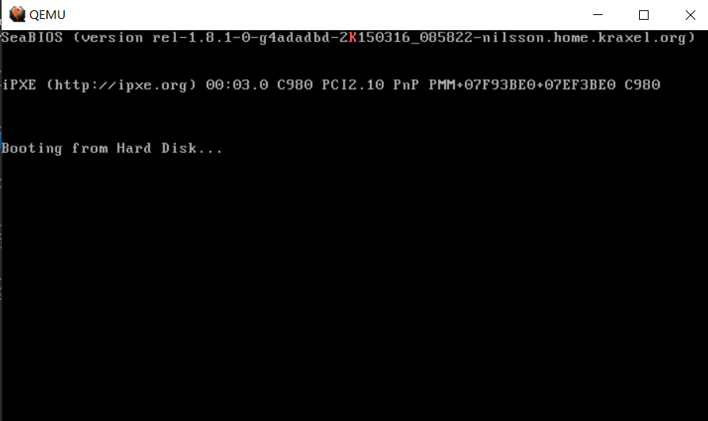

# Lab1-2

准备从 bootloader 跳入内核。

首先要完善`bootmain`，从6.828抄过来即可。由于需要用到几个端口I/O函数，所以我刚开始打算在`boot/lib.asm`直接用汇编进行实现（我无法忍受GNU内联汇编），然后在`boot/main.c`里调用。

`bootmain`的任务把 ELF 格式的 kernel 加载到物理地址`0x10000`处的内存，然后定位到 kernel 代码段入口地址并跳转过去。那么得先有一个 kernel 的雏形，也就是`kernel/entry.asm`：
```
global _start

[SECTION .text]
_start:
    mov  ah, 0Ch
    mov  al, 'K'
    mov  ebx, 0B8000h + (80*0+39)*2
    mov  [ebx], ax
    jmp $
```

我们需要把它编译链接成可执行的 ELF 二进制文件，所以需要定义代码段`.text`并导出`_start`符号供链接器识别。6.828通过链接脚本`kern/kernel.ld`指定的 kernel 链接地址(link address, the *entry point* of the program)为`0x100000`；简单起见，我直接在链接选项中`-Ttext 0x100000`。

编译链接后得到内核`obj/kernel/kernel`。现在需要将其放进 JOS 的启动盘`obj/jos.img`，位于引导扇区之后，详见`kernel/Makefile.kernel`：
```Makefile
$(OBJDIR)/jos.img: $(OBJDIR)/kernel/kernel $(OBJDIR)/boot/boot
    dd if=/dev/zero of=$@~ count=10000 2>/dev/null
    dd if=$(OBJDIR)/boot/boot of=$@~ conv=notrunc 2>/dev/null
    dd if=$(OBJDIR)/kernel/kernel of=$@~ seek=1 conv=notrunc 2>/dev/null
    mv $@~ $@
```
`dd`命令的`seek=1`参数：写入位置的块偏移为1，也就是第2个扇区。

一切准备就绪，然而`make`出错了！bootloader 的代码大小超过了510字节，无法放进引导扇区！为了削减代码尺寸，我进行了如下更改：
1. 编译`boot/main.c`时加上`-Os`优化选项，尽量降低代码的大小，见`boot/Makefile.boot`；
2. 删除`boot/boot.asm`里面的`ALIGN`伪指令，因为我发现为了对齐，nasm会在代码中间添加一些`nop`；
3. **最重要的一点**，我的`boot/main.c`对`boot/lib.asm`里的函数的调用是无法内联展开的，所以生成了大量的C语言函数调用所需的指令。无奈之下我把6.828以内联汇编写的`static inline`函数抄了过来，放在`include/x86.h`里面。为了区别于我写在`boot/lib.asm`的几个，我给它们加上了`x86_`前缀，以后也不会再使用它们了。至于`boot/lib.asm`就暂时放在那儿，将来有需要时再做调整。

现在`make`可以成功了。启动JOS，屏幕上红色的"K"说明我们成功从 bootloader 跳转进了 kernel：

