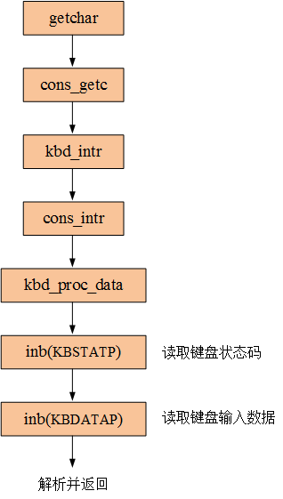
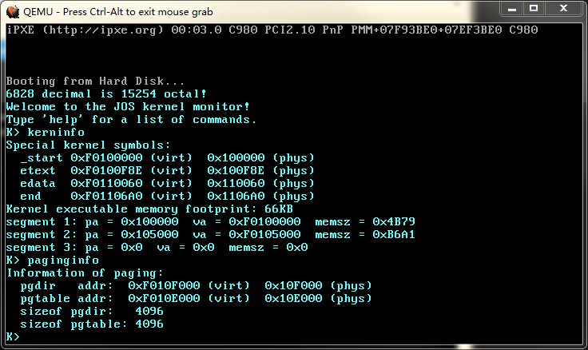

# Lab1-4

## 键盘输入
虽然目前尚未实现中断系统，但并不妨碍我们实现对键盘输入的处理，直接操作I/O端口即可。与键盘输入相关的代码位于`kernel/console.c`，全部来自6.828。函数调用链如下图所示：



## 屏幕输出
现在需要打印到屏幕上的信息越来越多了，一个80×25的屏幕已经不够用了，所以需要在`kernel/console.c`的`cga_putc()`里添加一段代码：
```c
  // What is the purpose of this?
  // 当显示范围超出当前屏幕大小时进行“滚屏”
  if (crt_pos >= CRT_SIZE) {
    int i;

    memmove(crt_buf, crt_buf + CRT_COLS, (CRT_SIZE - CRT_COLS) * sizeof(uint16_t));
		for (i = CRT_SIZE - CRT_COLS; i < CRT_SIZE; i++) {
      // crt_buf[i] = 0x0700 | ' '; // 黑底(00)灰色(07)的空格' '. 颜色属性不重要, 只要是空格' '就行了.
      crt_buf[i] = ' ';
    }
    crt_pos -= CRT_COLS;
  }
```

6.828在 Lab1 里要求我们解释这段代码的作用，答案就是：当显示范围超出当前屏幕大小时进行“滚屏”。

## 交互
实现交互的代码位于`kernel/monitor.c`和`lib/readline.c`，从6.828抄过来即可。我在`monitor.c`里添加了两条操作：`paginginfo`(显示页表信息)和`reboot`(重启)；省去了`backtrace`——我已经在 Lab1 里完成了。

## 结语
至此，Lab1 已经搭建完成，我保留了6.828的核心部分，省去了与内核无关的冗余模块（串口输出和`stab`调试相关）。



`objdump`和`readelf`输出的 kernel 信息：
```
$ objdump -h obj/kernel/kernel

obj/kernel/kernel:     file format elf32-i386

Sections:
Idx Name          Size      VMA       LMA       File off  Algn
  0 .text         00000f8e  f0100000  00100000  00001000  2**4
                  CONTENTS, ALLOC, LOAD, READONLY, CODE
  1 .rodata       000002eb  f0100f90  00100f90  00001f90  2**2
                  CONTENTS, ALLOC, LOAD, READONLY, DATA
  2 .stab         00002341  f010127c  0010127c  0000227c  2**2
                  CONTENTS, ALLOC, LOAD, READONLY, DATA
  3 .stabstr      000015bc  f01035bd  001035bd  000045bd  2**0
                  CONTENTS, ALLOC, LOAD, READONLY, DATA
  4 .data         0000b050  f0105000  00105000  00006000  2**12
                  CONTENTS, ALLOC, LOAD, DATA
  5 .bss          00000641  f0110060  00110060  00011060  2**5
                  CONTENTS, ALLOC, LOAD, DATA
  6 .comment      00000035  00000000  00000000  000116a1  2**0
                  CONTENTS, READONLY
```

```
$ readelf -l obj/kernel/kernel

Elf file type is EXEC (Executable file)
Entry point 0xf0100000
There are 3 program headers, starting at offset 52

Program Headers:
  Type           Offset   VirtAddr   PhysAddr   FileSiz MemSiz  Flg Align
  LOAD           0x001000 0xf0100000 0x00100000 0x04b79 0x04b79 R E 0x1000
  LOAD           0x006000 0xf0105000 0x00105000 0x0b6a1 0x0b6a1 RW  0x1000
  GNU_STACK      0x000000 0x00000000 0x00000000 0x00000 0x00000 RWE 0x10

 Section to Segment mapping:
  Segment Sections...
   00     .text .rodata .stab .stabstr
   01     .data .bss
   02
```