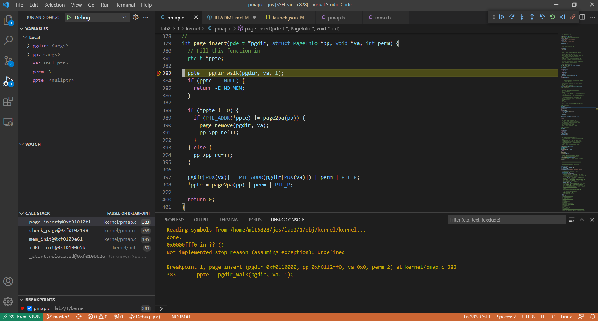
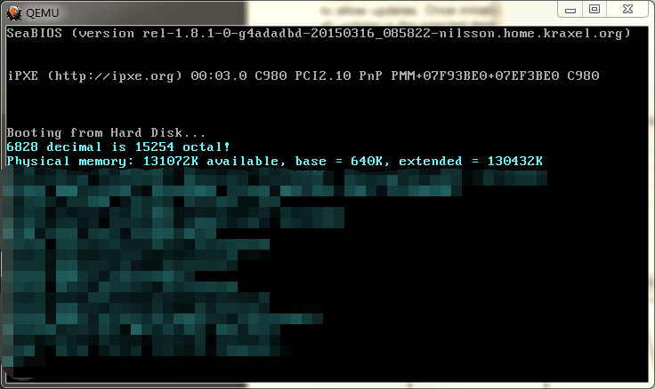
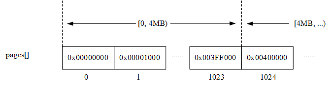
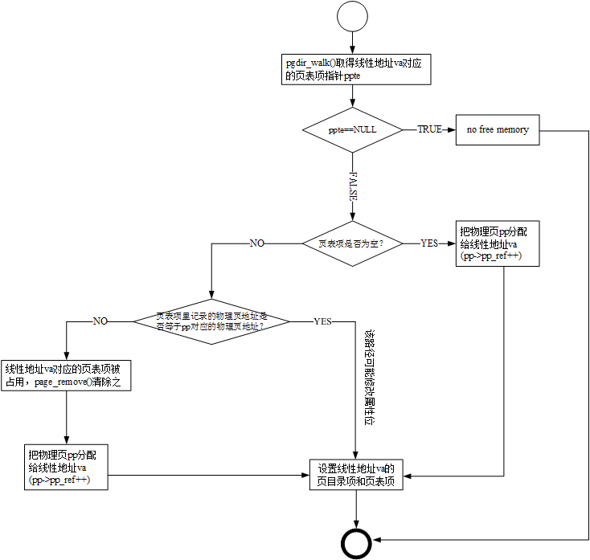
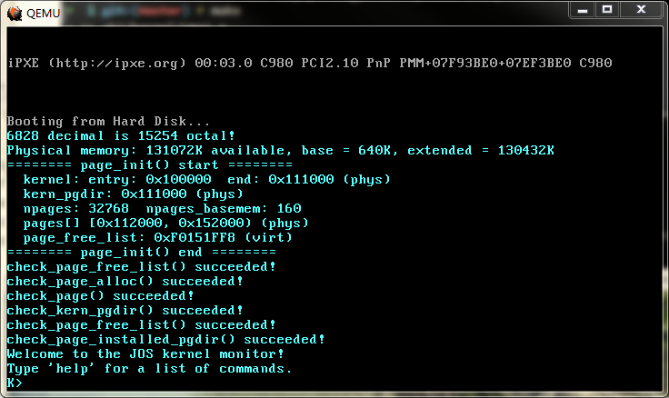
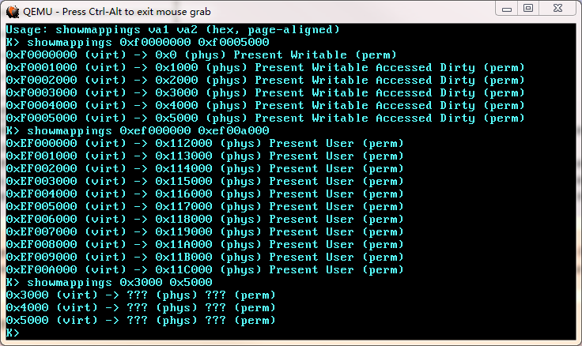

# Lab2-1

## 使用 vscode-gdb 调试代码
1. 在目标机上安装插件“Native Debug”
2. "Run -> Add Configuration... -> GDB", 编辑`launch.json`:
```json
{
	// Use IntelliSense to learn about possible attributes.
	// Hover to view descriptions of existing attributes.
	// For more information, visit: https://go.microsoft.com/fwlink/?linkid=830387
	"version": "0.2.0",
	"configurations": [
		{
			"name": "Debug",
			"type": "gdb",
			"request": "attach",
			"remote": true,
			"target": "localhost:1234",
			"cwd": "${workspaceRoot}",
			"executable": "${workspaceRoot}/lab2/1/obj/kernel/kernel",
			"valuesFormatting": "parseText"
		}
	]
}
```
3. `make qemu-gdb`准备好后，在 vscode 里`F5`便可以开启调试并命中断点：


但是由于未知原因，有的变量无法在`VARIABLES`窗口查看，还是要在`DEBUG CONSOLE`里使用gdb命令进行操作。

## Getting started
Lab2 Memory Management 需要新增以下几个文件：
```
kernel
├── kclock.c
├── kclock.h
├── pmap.c
└── pmap.h
```
从6.828拷贝过来即可。`kernel/init.c`的`i386_init()`将会调用`kernel/pmap.c`的`mem_init()`，开启 Lab2 之旅。

## Implementations
### 物理内存探测: `i386_detect_memory()`
```c
static void i386_detect_memory(void) {
  size_t basemem, extmem, ext16mem, totalmem;

  // Use CMOS calls to measure available base & extended memory.
  // (CMOS calls return results in kilobytes.)
  basemem = nvram_read(NVRAM_BASELO);
  extmem = nvram_read(NVRAM_EXTLO);
  ext16mem = nvram_read(NVRAM_EXT16LO) * 64;

  // Calculate the number of physical pages available in both base
  // and extended memory.
  if (ext16mem) {
    totalmem = 16 * 1024 + ext16mem;
  } else if (extmem) {
    totalmem = 1 * 1024 + extmem;
  } else {
    totalmem = basemem;
  }

  npages = totalmem / (PGSIZE / 1024);
  npages_basemem = basemem / (PGSIZE / 1024);

  printf("Physical memory: %dK available, base = %dK, extended = %dK\n", totalmem, basemem, totalmem - basemem);
}
```
通过 MC146818 REAL-TIME CLOCK PLUS RAM (RTC) 获取内存信息，分为三段：
- `basemem`：`[0,1M)`范围内的可用内存
- `extmem`：`[1M,16M)`范围内的可用内存
- `ext16mem`：`[16M,4G)`范围内的可用内存

（附上 MC146818 芯片[资料](https://pdf1.alldatasheet.com/datasheet-pdf/view/122156/MOTOROLA/MC146818.html)）

结果如下图所示：



物理内存总量为128M。基本内存总量为640K。这里的“640K基本内存、1M以上的扩展内存”是什么？

DOS操作系统最早设计时，8086 CPU只支持1M的寻址空间，所以DOS只能管理最多1M字节的连续内存空间。在这1M内存中，又只有640K被留给应用程序使用，它们被称为基本内存，其它384K被称为高端内存，是留给视频显示和BIOS等使用的。现在的PC机仍需要与DOS兼容，所以保留了当年的640K基本内存这种结构。

到了80286时代，保护模式出现了。80286 CPU拥有24位地址总线，通过其保护模式提供了16M的内存寻址空间。后面的 80386 CPU 拥有32位地址总线，寻址空间达到了4G。

### `mem_init()`
1. 调用`i386_detect_memory()`探测物理内存，初始化全局变量`npages`和`npages_basemem`。

2. 在 kernel 的`.bss`段后面分配一个page用做页目录：
```c
  // create initial page directory.
  kern_pgdir = (pde_t *)boot_alloc(PGSIZE);
  memset(kern_pgdir, 0, PGSIZE);
```
注意`kern_pgdir`是一个虚拟地址，位于`KERNBASE`之上。

3. 把虚拟地址`UVPT`映射到`kern_pgdir`所在的物理页，暂时不知其用意：
```c
  // Recursively insert PD in itself as a page table, to form
  // a virtual page table at virtual address UVPT.
  // (For now, you don't have understand the greater purpose of the
  // following line.)

  // Permissions: kernel R, user R
  kern_pgdir[PDX(UVPT)] = PADDR(kern_pgdir) | PTE_U | PTE_P;
```

4. 分配`npages`个连续的`PageInfo`用于管理全部的物理页：
```c
  // Allocate an array of npages 'struct PageInfo's and store it in 'pages'.
  // The kernel uses this array to keep track of physical pages: for
  // each physical page, there is a corresponding struct PageInfo in this
  // array.  'npages' is the number of physical pages in memory.  Use memset
  // to initialize all fields of each struct PageInfo to 0.
  // Your code goes here:
  pages = (struct PageInfo *)boot_alloc(npages * sizeof(struct PageInfo));
  memset(pages, 0, npages * sizeof(struct PageInfo));
```



上图中的每个矩形代表一个`PageInfo`，里面的数字是该`PageInfo`对应的物理页地址。`kernel/pmap.h`提供了一个由给定的`PageInfo`得到对应物理页地址的函数`page2pa()`:
```c
static inline physaddr_t page2pa(struct PageInfo *pp) {
  return (pp - pages) << PGSHIFT;
}
```

5. `page_init()`:
```c
  // Now that we've allocated the initial kernel data structures, we set
  // up the list of free physical pages. Once we've done so, all further
  // memory management will go through the page_* functions. In particular,
  // we can now map memory using boot_map_region or page_insert
  page_init();
```

按照注释进行是实现即可。对于`[EXTPHYSMEM,...)`（也就是1M以上的扩展内存，现在知道为什么bootloader要把kernel加载到1M这个地址上了）的物理内存，除了以下3块内容，其余均为空闲：
- kernel
- `mem_init()`里面分配的一个页目录`kern_pgdir`
- `mem_init()`里面分配的`pages[]`数组

但是，为什么没有目前使用的页目录`entry_pgdir`和页表`entry_pgtable`？因为他们是直接编译进kernel的，位于kernel的范围内。

要完成`mem_init()`余下的代码需要先以下函数：

### `page_alloc()`
```c
struct PageInfo *page_alloc(int alloc_flags) {
  // Fill this function in
  struct PageInfo *pp;

  if (page_free_list == NULL) {
    return NULL;
  }
  pp = page_free_list;
  page_free_list = page_free_list->pp_link;
  pp->pp_link = NULL;

  if (alloc_flags & ALLOC_ZERO) {
    memset(page2kva(pp), 0, PGSIZE);
  }

  return pp;
}
```
从`page_free_list`取出一个空闲物理页，然后更新`page_free_list`指向下一个空闲物理页（严格来说应该是“空闲物理页的描述符`PageInfo`结构”）。

为什么要用`page2kva()`取虚拟地址？

因为在目前的二级页表中`[0,4M)`的虚拟内存是只读的，要想向这块物理地址写入数据就需要把虚拟地址提高到`KERNBASE`之上。

### `page_free()`
```c
void page_free(struct PageInfo *pp) {
  // Fill this function in
  // Hint: You may want to panic if pp->pp_ref is nonzero or
  // pp->pp_link is not NULL.
  if (pp->pp_ref != 0) {
    panic("page_free: pp->pp_ref != nonzero");
  }
  if (pp->pp_link) {
    panic("page_free: pp->pp_link != NULL");
  }

  pp->pp_link = page_free_list;
  page_free_list = pp;
}
```

### `pgdir_walk()`
```c
pte_t *pgdir_walk(pde_t *pgdir, const void *va, int create) {
  // Fill this function in
  struct PageInfo *pp;
  pte_t *pgtable;

  pgtable = (pte_t *)PTE_ADDR(pgdir[PDX(va)]);
  if (pgtable == NULL) {
    if (!create) {
      return NULL;
    }
    pp = page_alloc(ALLOC_ZERO);
    if (pp == NULL) {
      return NULL;
    }
    pp->pp_ref++;
    pgtable = (pte_t *)page2pa(pp);
    pgdir[PDX(va)] = (uintptr_t)pgtable | PTE_P | PTE_W;
  }
  pgtable = (pte_t *)KADDR((physaddr_t)pgtable);
  return &pgtable[PTX(va)];
}
```
这个函数非常重要。根据线性地址`va`查询二级页表，返回一个指向页表项的指针——该页表项应该存储线性地址`va`映射到的物理页地址（低12 bits是属性）。

首先通过`PDX`宏取得`va`的高10 bits，即页目录的索引，得到页目录项`pgdir[PDX(va)]`；再通过`PTE_ADDR`清除属性位，得到页表的物理地址，赋值给`pgtable`；

若页表不存在且`create == true`则调用`page_alloc()`分配一个物理页作为页表，将页表物理地址写入页目录项`pgdir[PDX(va)]`；

最后返回页表项`pgtable[PTX(va)]`的指针——这个指针必须是`KERNBASE`之上的虚拟地址，否则调用者无法向其写入。

### `page_insert()`
```c
int page_insert(pde_t *pgdir, struct PageInfo *pp, void *va, int perm) {
  // Fill this function in
  pte_t *ppte;

  ppte = pgdir_walk(pgdir, va, true);
  if (ppte == NULL) {
    return -E_NO_MEM;
  }

  if (*ppte != 0) {
    if (PTE_ADDR(*ppte) != page2pa(pp)) {
      page_remove(pgdir, va);
      pp->pp_ref++;
    }
  } else {
    pp->pp_ref++;
  }

  pgdir[PDX(va)] = PTE_ADDR(pgdir[PDX(va)]) | perm | PTE_P;
  *ppte = page2pa(pp) | perm | PTE_P;

  return 0;
}
```
这个函数的实现比较复杂，需要覆盖众多的corner case，我调试了很久。流程图：



### `page_lookup()`
略

### `page_remove()`
略

### `boot_map_region()`
```c
//
// Map [va, va+size) of virtual address space to physical [pa, pa+size)
// in the page table rooted at pgdir.  Size is a multiple of PGSIZE, and
// va and pa are both page-aligned.
// Use permission bits perm|PTE_P for the entries.
//
// This function is only intended to set up the ``static'' mappings
// above UTOP. As such, it should *not* change the pp_ref field on the
// mapped pages.
//
// Hint: the TA solution uses pgdir_walk
static void boot_map_region(pde_t *pgdir, uintptr_t va, size_t size, physaddr_t pa, int perm) {
  // Fill this function in
  assert(va % PGSIZE == 0);
  assert(pa % PGSIZE == 0);
  assert(size % PGSIZE == 0);

  uint64_t __u64_va = (uint64_t)va;
  uint64_t __u64_va_end = __u64_va + size;
  uint64_t __u64_pa = (uint64_t)pa;
  pte_t *ppte;

  while (__u64_va < __u64_va_end) {
    va = (uintptr_t)__u64_va;
    pa = (uintptr_t)__u64_pa;
    ppte = pgdir_walk(pgdir, (const void *)va, true);
    assert(ppte);
    *ppte = pa | perm | PTE_P;

    __u64_va += PGSIZE;
    __u64_pa += PGSIZE;
  }
}
```
需要注意32位整数的溢出问题，例如`0xFFFFF000`再加上`0x1000(PGSIZE)`就会产生溢出，导致死循环，所以要使用64位整数进行计算。

### `mem_init()`的后半部分
按照注释用`boot_map_region()`建立地址映射即可，最后将新的页目录地址加载到`CR3`：
```c
  // Switch from the minimal entry page directory to the full kern_pgdir
  // page table we just created.	Our instruction pointer should be
  // somewhere between KERNBASE and KERNBASE+4MB right now, which is
  // mapped the same way by both page tables.
  //
  // If the machine reboots at this point, you've probably set up your
  // kern_pgdir wrong.
  lcr3(PADDR(kern_pgdir));
```

Lab2的工作就完成了：



## 修改/扩展kernel monitor
### kerninfo
由于`kernel/pmap.c`里的`check_*`函数修改了kernel所在内存（从`0x10000`开始）的数据，所以不能再从中读出 ELF 文件的相关信息了，只能显示那几个`extern`变量。

### paginginfo
以前位于kernel里的`entry_pgdir`和`entry_pgtale`已经无效了，`paginginfo`这个命令也不再需要了。

### showmappings
*Challenge!* 要求我们实现`showmappings`用于展示地址映射信息，这对后续的调试很有帮助，不妨实现一下：


