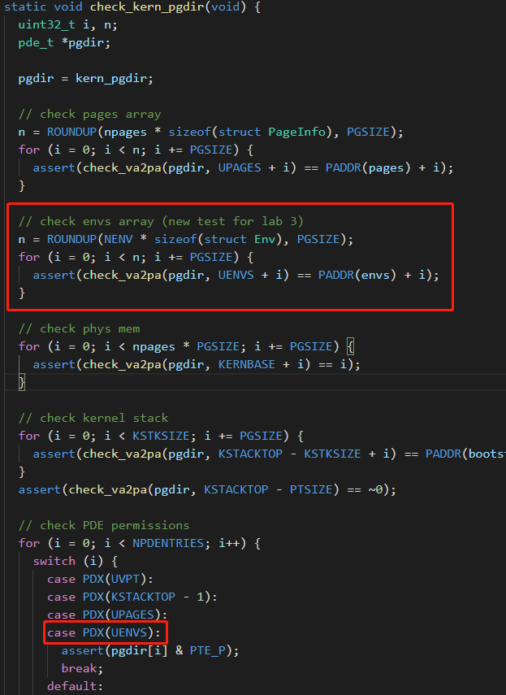
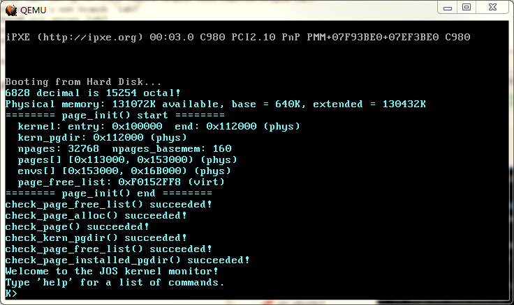

# Lab3-1

## Part A: User Environments and Exception Handling

### Allocating the Environments Array

> **Exercise 1**. Modify `mem_init()` in `kern/pmap.c` to allocate and map the envs array. This array consists of exactly `NENV` instances of the `Env` structure allocated much like how you allocated the pages array. Also like the pages array, the memory backing envs should also be mapped user read-only at `UENVS` (defined in `inc/memlayout.h`) so user processes can read from this array.
> You should run your code and make sure `check_kern_pgdir()` succeeds.

先把6.828的这几个文件拷贝过来：
```
 inc/env.h
     trap.h
kern/env.h
     env.c
```
保证 Exercise 1 能跑通。另外，暂时把`kernel/env.c`的这个函数注释掉：
```c
// Load GDT and segment descriptors.
void env_init_percpu(void) {
  // lgdt(&gdt_pd);
  // // The kernel never uses GS or FS, so we leave those set to
  // // the user data segment.
  // asm volatile("movw %%ax,%%gs" : : "a"(GD_UD | 3));
  // asm volatile("movw %%ax,%%fs" : : "a"(GD_UD | 3));
  // // The kernel does use ES, DS, and SS.  We'll change between
  // // the kernel and user data segments as needed.
  // asm volatile("movw %%ax,%%es" : : "a"(GD_KD));
  // asm volatile("movw %%ax,%%ds" : : "a"(GD_KD));
  // asm volatile("movw %%ax,%%ss" : : "a"(GD_KD));
  // // Load the kernel text segment into CS.
  // asm volatile("ljmp %0,$1f\n 1:\n" : : "i"(GD_KT));
  // // For good measure, clear the local descriptor table (LDT),
  // // since we don't use it.
  // lldt(0);
}
```

现在开始 Exercise 1。Lab 3 对`kernel/pmap.c`进行了一些补充。先看`check_kern_pgdir()`，与 Lab 3 有关的测试有两处：



现在到`mem_init()`里完成 Exercise 1 要求我们做的：
```
  //////////////////////////////////////////////////////////////////////
  // Make 'envs' point to an array of size 'NENV' of 'struct Env'.
  // LAB 3: Your code here.
  envs = (struct Env *)boot_alloc(NENV * sizeof(struct Env));
  memset(envs, 0, NENV * sizeof(struct Env));
```

```
  //////////////////////////////////////////////////////////////////////
  // Map the 'envs' array read-only by the user at linear address UENVS
  // (ie. perm = PTE_U | PTE_P).
  // Permissions:
  //    - the new image at UENVS  -- kernel R, user R
  //    - envs itself -- kernel RW, user NONE
  // LAB 3: Your code here.
  boot_map_region(kern_pgdir, UENVS, ROUNDUP(NENV * sizeof(struct Env), PGSIZE), PADDR(envs), PTE_U);
```

然后在`page_init()`里面把`envs[]`所在的页面标记为“非空闲”。最后通过`check_kern_pgdir()`测试：

