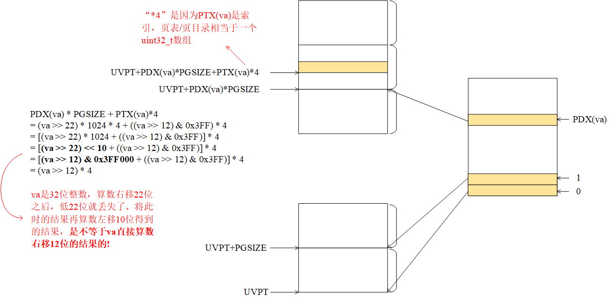
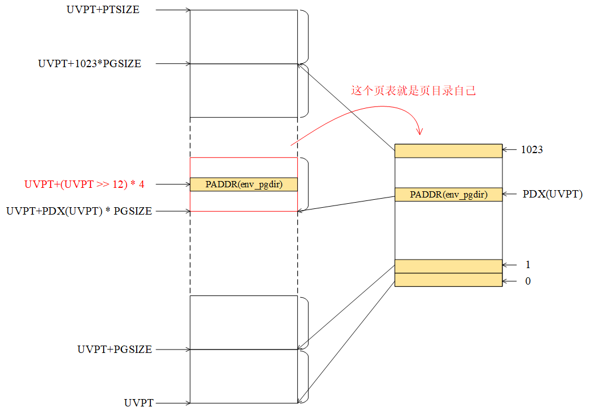

# Lab3-1

## Part A: User Environments and Exception Handling

先重写一下`Makefile`。以`kernel/Makefile`为例：
```Makefile
KERNEL_SRCS := kernel/console.c \
	kernel/entry.asm \
	kernel/entrypgdir.c \
	kernel/env.c \
	kernel/init.c \
	kernel/kclock.c \
	kernel/lib.asm \
	kernel/monitor.c \
	kernel/pmap.c \
	kernel/trap.c

KERNEL_OBJS := $(patsubst kernel/%.c, $(OBJDIR)/kernel/%.o, $(KERNEL_SRCS))
KERNEL_OBJS := $(patsubst kernel/%.asm, $(OBJDIR)/kernel/%.o, $(KERNEL_OBJS))

$(OBJDIR)/kernel/%.o: kernel/%.c
	@echo + cc $@
	@mkdir -p $(@D)
	@$(CC) $(CFLAGS) $< -o $@

$(OBJDIR)/kernel/%.o: kernel/%.asm
	@echo + cc $@
	@mkdir -p $(@D)
	@$(AS) $(ASFLAGS) $< -o $@
```

像过去那样每增加一个源文件就要修改`Makefile`很是麻烦，所以向6.828学习，使用上面那样的写法。先解释`KERNEL_OBJS`的生成原理：

`patsubst`是模式替换函数。

- 格式：`$(patsubst <pattern>, <replacement>, <text>)`
- 功能：查找`<text>`中的字符串，把符合模式`<pattern>`的字符串替换为`<replacement>`。这里，`<pattern>`可以包括通配符`%`，表示任意长度的字符串。如果`<replacement>`中也包含`%`，那么`<replacement>`中的这个`%`将是`<pattern>`中的那个`%`所代表的字符串。

`KERNEL_OBJS`来自两部分，一是`*.c`文件，二是`*.asm`文件。首先把`KERNEL_SRCS`中的`*.c`文件替换为相应的`*.o`文件，注意，不匹配的部分（也就是`*.asm`文件）会被原样赋值给`KERNEL_OBJS`，所以还需要再使用一次`patsubst`函数，把`KERNEL_OBJS`中的`*.asm`文件替换为相应的`*.o`文件。

### Creating and Running Environment

`lib/entry.asm`里有如下代码：
```
global uvpd
    uvpd equ (UVPT+(UVPT>>12)*4)
```

根据`include/mmlayout.h`，`[UVPT, UVPT+PTSIZE)`这段虚拟内存是当前 User Environment 的一共1024个页表（这些页表在虚拟地址上是连续的）。给定一个虚拟地址`va`，如何找到它的PTE? 如下图所示：



所以从字面上看，`uvpd`就是`UVPT`这个虚拟地址对应的PTE的地址。注意到`kernel/env.c`的`env_setup_vm()`有这样一段代码：
```c
 e->env_pgdir[PDX(UVPT)] = PADDR(e->env_pgdir) | PTE_P | PTE_U;
```

User Environment 的页目录和页表是这样的：



`UVPT[UVPT>>12]`正好就是页目录的物理地址！真是绝了！