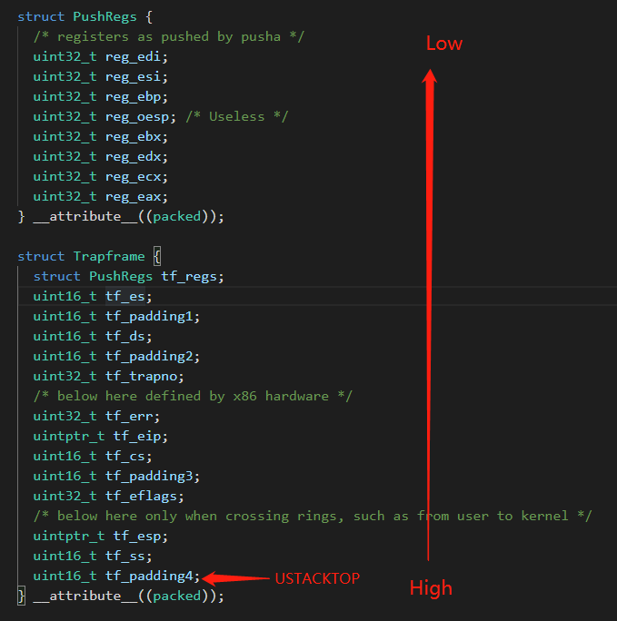
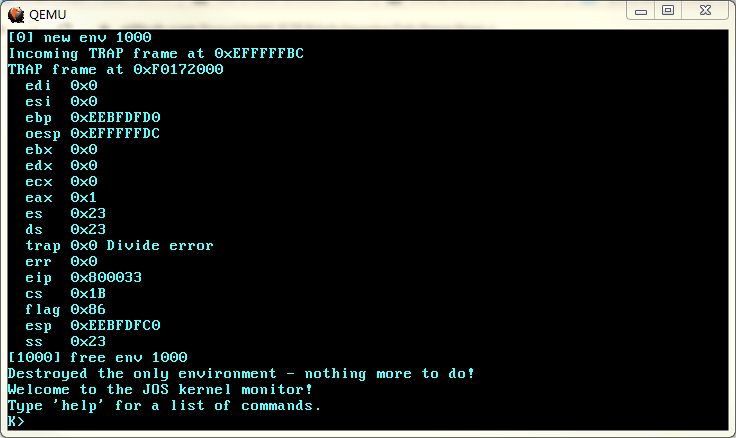

# Lab3-2

## Part A: User Environments and Exception Handling

### Handling Interrupts and Exceptions

`i386_init()`调用`trap_init()`初始化中断系统，相关代码如下：

```c
void trap_init(void) {
  extern struct Segdesc gdt[];

  // LAB 3: Your code here.

  static const void *const excentries[] = {divide_error,
                                           ......};

  int i;
  for (i = 0; i < ARRAY_SIZE(excentries); i++) {
    SETGATE(idt[i], 0, GD_KT, excentries[i], 0);
  }

  // Per-CPU setup
  trap_init_percpu();
}

// Initialize and load the per-CPU TSS and IDT
void trap_init_percpu(void) {
  // Setup a TSS so that we get the right stack
  // when we trap to the kernel.
  ts.ts_esp0 = KSTACKTOP;
  ts.ts_ss0 = GD_KD;
  ts.ts_iomb = sizeof(struct Taskstate);

  // Initialize the TSS slot of the gdt.
  gdt[GD_TSS0 >> 3] = SEG16(STS_T32A, (uint32_t)(&ts), sizeof(struct Taskstate) - 1, 0);
  gdt[GD_TSS0 >> 3].sd_s = 0;

  // Load the TSS selector (like other segment selectors, the
  // bottom three bits are special; we leave them 0)
  ltr(GD_TSS0);

  // Load the IDT
  lidt(&idt_pd);
}

// Set up a normal interrupt/trap gate descriptor.
// - istrap: 1 for a trap (= exception) gate, 0 for an interrupt gate.
//   see section 9.6.1.3 of the i386 reference: "The difference between
//   an interrupt gate and a trap gate is in the effect on IF (the
//   interrupt-enable flag). An interrupt that vectors through an
//   interrupt gate resets IF, thereby preventing other interrupts from
//   interfering with the current interrupt handler. A subsequent IRET
//   instruction restores IF to the value in the EFLAGS image on the
//   stack. An interrupt through a trap gate does not change IF."
// - sel: Code segment selector for interrupt/trap handler
// - off: Offset in code segment for interrupt/trap handler
// - dpl: Descriptor Privilege Level -
//	  the privilege level required for software to invoke
//	  this interrupt/trap gate explicitly using an int instruction.
#define SETGATE(gate, istrap, sel, off, dpl)         \
  {                                                  \
    (gate).gd_off_15_0 = (uint32_t)(off)&0xffff;     \
    (gate).gd_sel = (sel);                           \
    (gate).gd_args = 0;                              \
    (gate).gd_rsv1 = 0;                              \
    (gate).gd_type = (istrap) ? STS_TG32 : STS_IG32; \
    (gate).gd_s = 0;                                 \
    (gate).gd_dpl = (dpl);                           \
    (gate).gd_p = 1;                                 \
    (gate).gd_off_31_16 = (uint32_t)(off) >> 16;     \
  }
```

首先使用`SETGATE`在 IDT 中初始化0-19号中断门描述符。这里统一初始化成**中断门**，也就是`istrap==0`，这样一来，不论是“中断(interrupt)”还是“陷阱(trap)”，通过中断门进入后，`EFLAGS`的`IF`未都会被重置。因为中断例程必然要运行在内核，所以 DPL = 0，也就是 ring0。

然后，设置 TSS 的那3个字段，在 GDT 中写入 TSS 段的描述符，并将 TSS 选择子加载到`tr`寄存器。

TSS 的作用：ring3 向 ring0-2 转移时需要切换栈，所以 TSS 里定义了 ring0-2 的`ss`和`esp`。特权级转移时处理器要到 TSS 里取得新的栈段选择子和栈指针。

**编写0-19号中断和异常的入口点函数**

见`kernel/trapentry.asm`：

```
extern trap ; kernel/trap.c => void trap(struct Trapframe *tf)

%macro trap_handler 1
    push   %1
    push   ds
    push   es
    pushad

    mov   ax, ss ; ss == GD_KD
    mov   ds, ax
    mov   es, ax

    push  esp
    call  trap
%endmacro
```

`trap_handler`按照 Exercise 4 的提示实现即可：

> 1. push values to make the stack look like a struct Trapframe
> 2. load `GD_KD` into %ds and %es
> 3. `pushl %esp` to pass a pointer to the Trapframe as an argument to trap()
> 4. `call trap` (can `trap` ever return?)

在C语言里，结构体字段的排布是从低地址向高地址，而栈的是从高地址向地址生长的。



我们的目标是*push values to make the stack look like a struct Trapframe*。结合上图也就知道`trap_handler`为何那么写了。最后`push esp`的时候，`esp`的值等于`reg_edi`的第一字节的地址，也就是`Trameframe`结构体的首地址，将其作为`trap()`的参数传递过去即可`call trap`。

在完成了中断处理后需要从 ring0 返回 ring3。实现方法就是在`trap()`末尾调用`env_run()`，进而通过`env_pop_tf()`的`iret`指令返回。不过目前尚未完成`trap_dispatch()`：

```c
static void trap_dispatch(struct Trapframe *tf) {
  // Handle processor exceptions.
  // LAB 3: Your code here.

  // Unexpected trap: The user process or the kernel has a bug.
  print_trapframe(tf);
  if (tf->tf_cs == GD_KT) {
    panic("unhandled trap in kernel");
  } else {
    env_destroy(curenv);
    return;
  }
}
```
所以最后会留在kernel monitor：



（执行`user/divzero.c`产生除法错误）