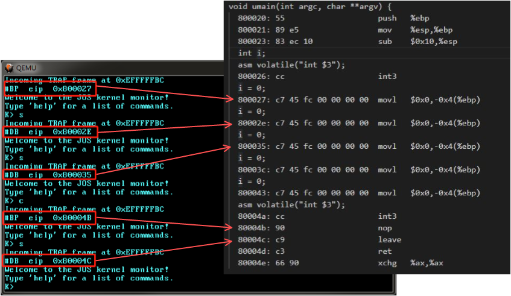
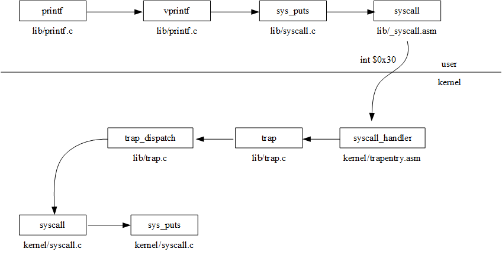
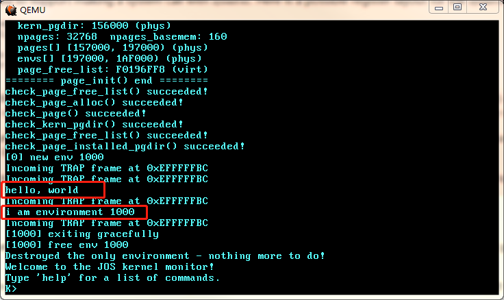
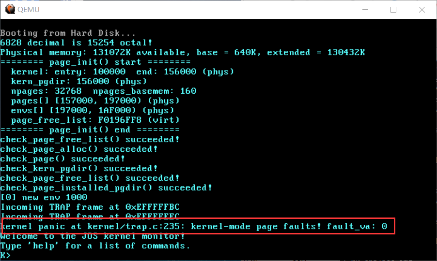
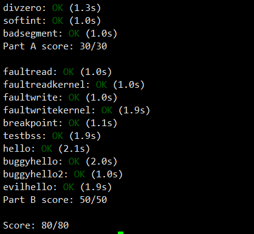

# Lab3-4

## Part B: Page Faults, Breakpoints Exceptions, and System Calls

先修改`trap_dispatch()`如下：

```c
static void trap_dispatch(struct Trapframe *tf) {
  // Handle processor exceptions.
  // LAB 3: Your code here.

  switch (tf->tf_trapno) {
    case T_DEBUG:
      // 当 TF=1 时, CPU执行完一条指令后产生单步中断, 进入中断处理程序后 TF 自动置0
      assert(!(read_eflags() & FL_TF));
      printf("#DB  eip  0x%x\n", tf->tf_eip);
      monitor(tf);
      return;
    case T_BRKPT:
      printf("#BP  eip  0x%x\n", tf->tf_eip);
      monitor(tf);
    case T_PGFLT:
      page_fault_handler(tf);
      return;
  }

  // Unexpected trap: The user process or the kernel has a bug.
  print_trapframe(tf);
  if (tf->tf_cs == GD_KT) {
    panic("unhandled trap in kernel");
  } else {
    env_destroy(curenv);
    return;
  }
}
```

根据`tf_trapno`对不同类型的中断异常进行处理。6.828要求实现对 Page Faults(#PF) 和 Breakpoint Exception(#BP) 的处理。Page Faults 暂时直接调用`page_fault_handler()`即可，具体实现留到后面进行。对于 Breakpoint Exception 由两个问题值得思考：

1. The break point test case will either generate a break point exception or a general protection fault depending on how you initialized the break point entry in the IDT (i.e., your call to `SETGATE` from `trap_init`). Why? How do you need to set it up in order to get the breakpoint exception to work as specified above and what incorrect setup would cause it to trigger a general protection fault?
2. What do you think is the point of these mechanisms, particularly in light of what the `user/softint` test program does?

之前在`trap_init()`里，全部中断门描述符的的 DPL 都被设置成了0。

通过中断门进行特权级转移时需要满足：

- CPL <= 中断门描述符DPL
- CPL >= 目标代码段（中断处理程序所在的代码段）DPL

CPL是当前执行的代码段的特权级；中断门描述符DPL就是`SETGATE`的`dpl`参数；目标代码段DPL比较复杂，首先`SETGATE`的`selector`参数是`GD_KT`，在GDT中找到它对应的描述符：

```c
struct Segdesc gdt[] = {
  ......
  // 0x8 - kernel code segment
  [GD_KT >> 3] = SEG(STA_X | STA_R, 0x0, 0xffffffff, 0),
  ...
};
```

`SEG`最后一个参数就是本段的DPL。

所以，中断门描述符DPL=0, 目标代码段DPL=0。如果在用户程序直接以`int`指令触发软中断时，CPL=3，因无法通过特权级检查而触发#GP。

6.828指出，用户程序执行`int $14`不应该触发#PF，而#GP，关键就在于把#PF的中断门描述符DPL设置成0。这么做的理由是显然的，#PF是一个被动行为，假如用户程序能主动触发#PF，而此时并不是真的发生了#PF，那么`cr2`的内容该是多少？

但是对于 Breakpoint Exception，应该把中断门描述符DPL设置成3，否则用户程序执行`int $3`的时候就会触发#GP。基于此在 kernel monitor 里实现对用户程序的调试："continue"和"stepi"。

```c
int mon_stepi(int argc, char **argv, struct Trapframe *tf) {
  tf->tf_eflags |= FL_TF;
  return -1; // 返回(-1)使得 monitor() 跳出循环并返回
}

int mon_continue(int argc, char **argv, struct Trapframe *tf) {
  tf->tf_eflags &= ~FL_TF;
  return -1;
}
```

“单步调试”是使用CPU的 Debug Exception(#DB) 实现的。Debug Exception 被触发的条件是`eflags`的`TF`被置1。此时CPU执行完当前指令后就会触发 Debug Exception，在把`eflags`等寄存器压栈后自动重置`TF`，否则执行中断处理程序的时候又要触发 Debug Exception。

首先，用户程序触发 Breakpoint Exception，来到`trap_dispatch()`的`case T_BRKT`分支，然后进入 kernel monitor。我们希望此时输入单步命令`s`后，CPU执行用户程序的下一条指令后重新回到 kernel monitor，等待我们的后续操作。之前分析过，中断处理程序返回用户程序的路径是`env_run() -> env_pop_tf()`。如果在`mon_stepi()`里面把`tf->tf_eflags`的`TF`位置1，那么最后在`env_pop_tf()`里通过`iret`指令返回到用户程序之后，`eflags`的`TF`位为1，`eip`指向`int3`的下一条指令（不同异常被触发时压栈的`eip`是不同的，有的是触发异常的那条指令的地址，例如#PF；有的是触发异常的那条指令的下一条指令的地址，例如#BP和#DB），执行之后触发#DB，于是从`trap_dispatch()`的`case T_DEBUG`分支再次进入 kernel monitor。

`mon_continue()`的实现与`mon_stepi()`是相反的，为了“继续执行”而不是每执行一条指令就断下来，需要把`eflags`的`TF`位置0。

演示效果如下：



打开`obj/user/breakpoint.objdump`进行对照。


### System Calls

6.828给的说明很详细，此处不再赘述。实现了系统调用后就可以实现用户层的`printf()`了：



### User-mode startup

有了系统调用的支持，就可以完成`libmain()`：

```c
void libmain(int argc, char **argv) {
  // set thisenv to point at our Env structure in envs[].
  // LAB 3: Your code here.
  envid_t envid = sys_getenvid();
  thisenv = &envs[ENVX(envid)];

  // save the name of the program so that panic() can use it
  if (argc > 0) {
    binaryname = argv[0];
  }

  // call user main routine
  umain(argc, argv);

  // exit gracefully
  exit();
}
```

现在，`user/hello`就可以正常工作了:



### Page faults and memory protection

对于内核 page faults, 6.828要求*If the kernel does page fault, it should panic and terminate.*

- `kernel/trap.c`
```c
void page_fault_handler(struct Trapframe *tf) {
  uint32_t fault_va;

  // Read processor's CR2 register to find the faulting address
  fault_va = rcr2();

  // Handle kernel-mode page faults.

  // LAB 3: Your code here.
  if (tf->tf_cs == GD_KT) {
    panic("kernel-mode page faults! fault_va: %08x\n", fault_va);
  }

  // We've already handled kernel-mode exceptions, so if we get here,
  // the page fault happened in user mode.
  ......
}
```

6.828没有对 kernel-mode page fault 的测试。我们可以随便在内核里写一行这样的代码`*(int*)0=0`即可简单测试：



对于"memory protection"，需要完成以下内容：

- `kernel/pmap.c`
```c
int user_mem_check(struct Env *env, const void *va, size_t len, int perm) {
  // LAB 3: Your code here.

  int i, ret = 0;
  uintptr_t addr;
  pde_t *pgtable;

  for (i = 0; i < ROUNDUP(len, PGSIZE); i += PGSIZE) {
    if ((env->env_pgdir[PDX(va + i)] & perm) != perm) {
      ret = -E_FAULT;
      break;
    }
    pgtable = (pde_t *)PTE_ADDR(KADDR(env->env_pgdir[PDX(va + i)]));
    if ((pgtable[PTX(va + i)] & perm) != perm) {
      ret = -E_FAULT;
      break;
    }
  }

  if (ret < 0) {
    // in order to pass the motherfucking thorny tests!!!
    addr = ROUNDDOWN((uintptr_t)va + i, PGSIZE);
    if (addr == 0) {
      user_mem_check_addr = (uintptr_t)va + i;
    } else {
      user_mem_check_addr = addr;
    }
  }

  return ret;
}
```

- `kernel/syscall.c`
```c
static void sys_cputs(const char *s, size_t len) {
  // Check that the user has permission to read memory [s, s+len).
  // Destroy the environment if not.

  // LAB 3: Your code here.
  user_mem_assert(curenv, s, len, 0);

  // Print the string supplied by the user.
  printf("%.*s", len, s);
}
```

通过 Lab 3 全部测试：



那些测试用的用户程序我就不搬过来了。