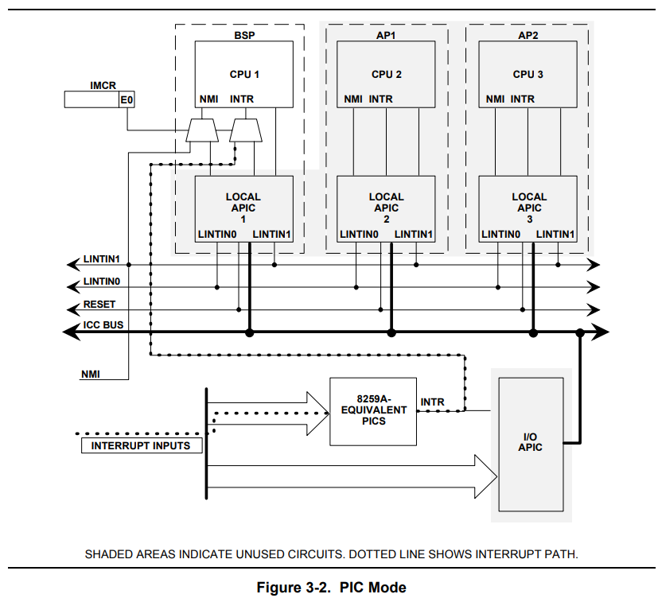
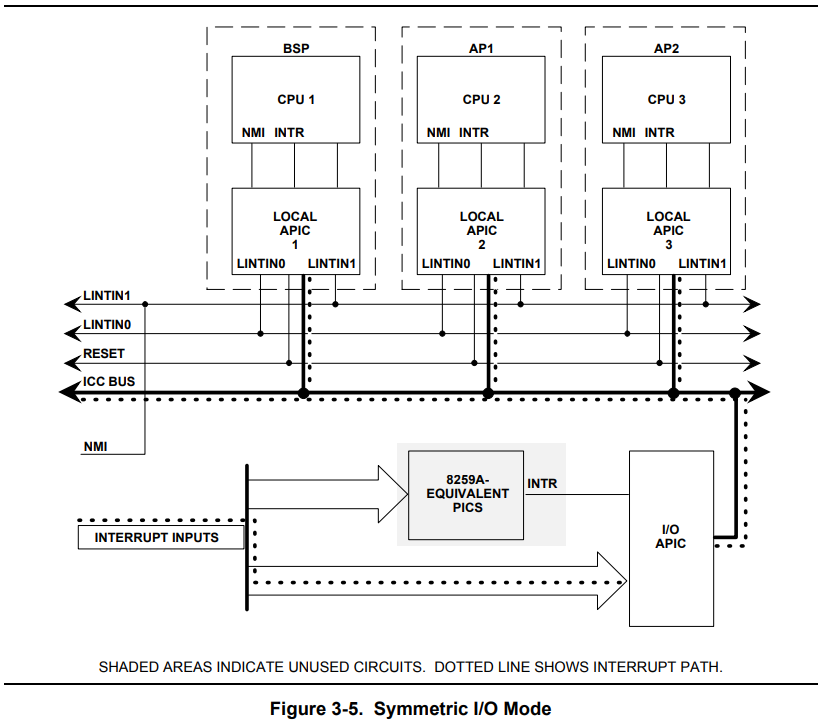

# Lab4-1

## Part A: Multiprocessor Support and Cooperative Multitasking

### Multiprocessor Support

#### Exercise 1
Implement `mmio_map_region()` in `kernel/pmap.c`:

```c
//
// Reserve size bytes in the MMIO region and map [pa,pa+size) at this
// location.  Return the base of the reserved region.  size does *not*
// have to be multiple of PGSIZE.
//
void *mmio_map_region(physaddr_t pa, size_t size) {
  // Where to start the next region.  Initially, this is the
  // beginning of the MMIO region.  Because this is static, its
  // value will be preserved between calls to mmio_map_region
  // (just like nextfree in boot_alloc).
  static uintptr_t base = MMIOBASE;

  // Reserve size bytes of virtual memory starting at base and
  // map physical pages [pa,pa+size) to virtual addresses
  // [base,base+size).  Since this is device memory and not
  // regular DRAM, you'll have to tell the CPU that it isn't
  // safe to cache access to this memory.  Luckily, the page
  // tables provide bits for this purpose; simply create the
  // mapping with PTE_PCD|PTE_PWT (cache-disable and
  // write-through) in addition to PTE_W.  (If you're interested
  // in more details on this, see section 10.5 of IA32 volume
  // 3A.)
  //
  // Be sure to round size up to a multiple of PGSIZE and to
  // handle if this reservation would overflow MMIOLIM (it's
  // okay to simply panic if this happens).
  //
  // Hint: The staff solution uses boot_map_region.
  //
  // Your code here:
  uintptr_t res = base;
  size = ROUNDUP(size, PGSIZE);
  if (base + size >= MMIOLIM) {
    panic("mmio_map_region error: reservation would overflow MMIOLIM");
  }
  boot_map_region(kern_pgdir, base, size, pa, PTE_W | PTE_PCD | PTE_PWT);
  base += size;
  return (void *)res;
}
```

#### Exercise 2
... Then modify your implementation of `page_init()` in `kernel/pmap.c` to avoid adding the page at `MPENTRY_PADDR` to the free list, ...

```c
void page_init(void) {
  ...
  for (i = 0, addr = 0; i < npages; i++, addr += PGSIZE) {
    pages[i].pp_ref = 0;

    if (addr == 0 || addr == MPENTRY_PADDR) {
    ...
}
```

#### 对`kernel/pmap.c`测试代码的修改
- `check_page_free_list()`
```c
static void check_page_free_list(bool only_low_memory) {
  ...
  for (pp = page_free_list; pp; pp = pp->pp_link) {
    ...
    // (new test for lab 4)
    assert(page2pa(pp) != MPENTRY_PADDR);
    ...
  }
  ...
}
```

- `check_page()`
```c
static void check_page(void) {
  ...
  // test mmio_map_region
  mm1 = (uintptr_t)mmio_map_region(0, 4097);
  mm2 = (uintptr_t)mmio_map_region(0, 4096);
  // check that they're in the right region
  assert(mm1 >= MMIOBASE && mm1 + 8192 < MMIOLIM);
  assert(mm2 >= MMIOBASE && mm2 + 8192 < MMIOLIM);
  // check that they're page-aligned
  assert(mm1 % PGSIZE == 0 && mm2 % PGSIZE == 0);
  // check that they don't overlap
  assert(mm1 + 8192 <= mm2);
  // check page mappings
  assert(check_va2pa(kern_pgdir, mm1) == 0);
  assert(check_va2pa(kern_pgdir, mm1 + PGSIZE) == PGSIZE);
  assert(check_va2pa(kern_pgdir, mm2) == 0);
  assert(check_va2pa(kern_pgdir, mm2 + PGSIZE) == ~0);
  // check permissions
  assert(*pgdir_walk(kern_pgdir, (void *)mm1, 0) & (PTE_W | PTE_PWT | PTE_PCD));
  assert(!(*pgdir_walk(kern_pgdir, (void *)mm1, 0) & PTE_U));
  // clear the mappings
  *pgdir_walk(kern_pgdir, (void *)mm1, 0) = 0;
  *pgdir_walk(kern_pgdir, (void *)mm1 + PGSIZE, 0) = 0;
  *pgdir_walk(kern_pgdir, (void *)mm2, 0) = 0;

  printf("check_page() succeeded!\n");
}
```

- `check_kern_pgdir()`
```c
static void check_kern_pgdir(void) {
  ...
  // check kernel stack
  // (updated in lab 4 to check per-CPU kernel stacks)
  // for (n = 0; n < NCPU; n++) {
  //   uint32_t base = KSTACKTOP - (KSTKSIZE + KSTKGAP) * (n + 1);
  //   for (i = 0; i < KSTKSIZE; i += PGSIZE) {
  //     assert(check_va2pa(pgdir, base + KSTKGAP + i) == PADDR(percpu_kstacks[n]) + i);
  //   }
  //   for (i = 0; i < KSTKGAP; i += PGSIZE) {
  //     assert(check_va2pa(pgdir, base + i) == ~0);
  //   }
  // }

  // check PDE permissions
  for (i = 0; i < NPDENTRIES; i++) {
    switch (i) {
      case PDX(UVPT):
      case PDX(KSTACKTOP - 1):
      case PDX(UPAGES):
      case PDX(UENVS):
      case PDX(MMIOBASE):
        assert(pgdir[i] & PTE_P);
        break;
      default:
        if (i >= PDX(KERNBASE)) {
          assert(pgdir[i] & PTE_P);
          assert(pgdir[i] & PTE_W);
        } else {
          assert(pgdir[i] == 0);
        }
        break;
    }
  }
  printf("check_kern_pgdir() succeeded!\n");
}
```

(注释尚未打开)

Lab 4 就此启航！

### 代码解析
#### 缩写
- IMCR = Interrupt Mode Configuration Register
- BSP = Bootstrap Processor
- PIC = Programmable Interrupt Controller (中断控制器)
- APIC = Advanced PIC (高级可编程中断控制器)
- LAPIC = Local APIC
- INTR = Interrupt Request (中断请求)
- NMI = Non-Maskable Interrput (不可屏蔽中断)

#### `kernel/mpconfig.c`
这部分代码由6.828提供，我对照[MP手册](https://pdos.csail.mit.edu/6.828/2018/readings/ia32/MPspec.pdf)手册进行分析。

**1. MP Floating Pointer Structure**

- 结构体定义：

```c
struct mp {              // floating pointer [MP 4.1]
  uint8_t signature[4];  // "_MP_"
  physaddr_t physaddr;   // phys addr of MP config table
  uint8_t length;        // 1
  uint8_t specrev;       // [14]
  uint8_t checksum;      // all bytes must add up to 0
  uint8_t type;          // MP system config type
  uint8_t imcrp;
  uint8_t reserved[3];
} __attribute__((__packed__));
```

见手册4.1, p39

注意：`imcrp`字段实则包括 MP FEATURE 和 INFORMATION BYTE 2 两部分，前者占 7 bits，后者占 1 bit，总共可用一个`uint8_t`来表示。

- 在内存中搜索 MP Floating Pointer Structure:

```c
// Search for the MP Floating Pointer Structure, which according to
// [MP 4] is in one of the following three locations:
// 1) in the first KB of the EBDA;
// 2) if there is no EBDA, in the last KB of system base memory;
// 3) in the BIOS ROM between 0xE0000 and 0xFFFFF.
static struct mp *mpsearch(void) {
  uint8_t *bda;
  uint32_t p;
  struct mp *mp;

  static_assert(sizeof(*mp) == 16);

  // The BIOS data area lives in 16-bit segment 0x40.
  bda = (uint8_t *)KADDR(0x40 << 4);

  // [MP 4] The 16-bit segment of the EBDA is in the two bytes
  // starting at byte 0x0E of the BDA.  0 if not present.
  if ((p = *(uint16_t *)(bda + 0x0E))) {
    p <<= 4;  // Translate from segment to PA
    if ((mp = mpsearch1(p, 1024))) {
      return mp;
    }
  } else {
    // The size of base memory, in KB is in the two bytes
    // starting at 0x13 of the BDA.
    p = *(uint16_t *)(bda + 0x13) * 1024;
    if ((mp = mpsearch1(p - 1024, 1024))) {
      return mp;
    }
  }
  return mpsearch1(0xF0000, 0x10000);
}
```

手册 p38 指出了 MP Floating Pointer Structure 可能位于哪里：This structure must be stored in at least one of the following memory locations, because the operating system searches for the MP floating pointer structure in the order described below...

- 地址`40:0Eh`处的`uint16_t`是什么？

The exact **starting address of the EBDA segment** for EISA or MCA systems can be found in a two-byte location (40:0Eh) of the BIOS data area.

也就是 EBDA segment 的段地址（段内偏移为0），所以需将其右移4位得到物理地址。然后在 EBDA segment 的开头 1K 内存空间内进行搜索，也就是"**a. In the first kilobyte of Extended BIOS Data Area (EBDA)**"

- 地址`40:13h`处的`uint16_t`是什么？

The BIOS reports the **base memory size** in a two-byte location (40:13h) of the BIOS data area. The base memory size is reported in kilobytes minus 1K, which is used by the EBDA segment or for other purposes.

```c
  p = *(uint16_t *)(bda + 0x13) * 1024;
  if ((mp = mpsearch1(p - 1024, 1024))) {
    return mp;
  }
```
所以上面这段代码的含义是：在 base memory 最后 1K 的内存空间内（e.g., 639K-640K for systems with 640KB of base memory）进行搜索，也就是"**b. Within the last kilobyte of system base memory if the EBDA segment is undefined**"

如果上面两个地方都没有搜索成功，就要到"**c. In the BIOS ROM address space between 0F0000h and 0FFFFFh**"进行搜索。

- `mpsearch1()`实现原理
```c
// Look for an MP structure in the len bytes at physical address addr.
static struct mp *mpsearch1(physaddr_t a, int len) {
  struct mp *mp = KADDR(a), *end = KADDR(a + len);

  for (; mp < end; mp++) {
    if (memcmp(mp->signature, "_MP_", 4) == 0 && sum(mp, sizeof(*mp)) == 0) {
      return mp;
    }
  }
  return NULL;
}
```
首先要确定`signature`是否为`_MP_`，其次还要判断结构体是否有效，见`checksum`的定义：A checksum of the complete pointer structure. All bytes specified by the length field, including CHECKSUM and reserved bytes, must add up to zero.

**2. MP Configuration Table Header**

结构体定义：

```c
struct mpconf {          // configuration table header [MP 4.2]
  uint8_t signature[4];  // "PCMP"
  uint16_t length;       // total table length
  uint8_t version;       // [14]
  uint8_t checksum;      // all bytes must add up to 0
  uint8_t product[20];   // product id
  physaddr_t oemtable;   // OEM table pointer
  uint16_t oemlength;    // OEM table length
  uint16_t entry;        // entry count
  physaddr_t lapicaddr;  // address of local APIC
  uint16_t xlength;      // extended table length
  uint8_t xchecksum;     // extended table checksum
  uint8_t reserved;
  uint8_t entries[0];  // table entries
} __attribute__((__packed__));
```

见手册4.2, p41

和之前一样，这里的`checksum`也是同样的含义：A checksum of the entire base configuration table. All bytes, including CHECKSUM and reserved bytes, must add up to zero.

基于上述分析，就很容易看懂`mpconfig()`了。

**3. MP Configuration Table Entries**
手册4.3, p42-43的内容有助于理解`mp_init()`遍历 entries 的实现逻辑。

**4. Processor Entries**

结构体定义：

```c
struct mpproc {          // processor table entry [MP 4.3.1]
  uint8_t type;          // entry type (0)
  uint8_t apicid;        // local APIC id
  uint8_t version;       // local APIC version
  uint8_t flags;         // CPU flags
  uint8_t signature[4];  // CPU signature
  uint32_t feature;      // feature flags from CPUID instruction
  uint8_t reserved[8];
} __attribute__((__packed__));
```

见手册4.3.1, p43

如果启用多处理器，就会找到多个 Processor Entry，每一个 Processor Entry 都会对应到`cpus`里的一个`struct CpuInfo`，见`mp_init()`。比较特别的一个是 bootstrap processor，对应的`struct CpuInfo`为`bootcpu`所指。

**5. `mp_init()`**

```c
void mp_init(void) {
  ......
  if (mp->imcrp) {
    // [MP 3.2.6.1] If the hardware implements PIC mode,
    // switch to getting interrupts from the LAPIC.
    printf("SMP: Setting IMCR to switch from PIC mode to symmetric I/O mode\n");
    outb(0x22, 0x70);           // Select IMCR
    outb(0x23, inb(0x23) | 1);  // Mask external interrupts.
  }
}
```

回顾`mp::imcrp`的定义：When the IMCR presence bit is set, the IMCR is present and PIC Mode is implemented; otherwise, Virtual Wire Mode is implemented.

手册3.6.2, p26-27, 三种中断模式：

The MP specification defines three different interrupt modes as follows:

- *PIC Mode* effectively bypasses all APIC components and forces the system to operate in single-processor mode.
- *Virtual Wire Mode* uses an APIC as a virtual wire, but otherwise operates the same as PIC Mode.
- *Symmetric I/O Mode* enables the system to operate with more than one processor.

所以在多处理模式下，需要由 PIC 模式切换到 Symmetric I/O 模式——如果硬件实现了 PIC 模式的话。

下图是 PIC 和 Symmetric I/O 模式下的中断请求传输路径：





可以看到，在单处理器模式下，INTR 经 8259A 直接打到 BSP，NMI 则直接打到 BSP（所以叫不可屏蔽中断）。在多处理器模式下，INTR 不再经过 8259A，而是经过 I/O APIC 打到与每一个 CPU 相连的 Local APIC 上，然后再分别打到每个 CPU 上；NMI 则打到 Local APIC 上。

按照手册p28，由 PIC 切换到 Symmetric I/O 时，首先 write a value of 70h to I/O port 22h, which selects the IMCR. 然后 Writing a value of 01h forces the NMI and 8259 INTR signals to pass through the APIC. 所以`outb(0x23, inb(0x23) | 1)`的作用严格来说不是“屏蔽外部中断”，而是改变 INTR 和 NMI 的路径，如 Figure 3-5 所示。


**小小的意外**

当我把`kernel/mpconfig.c`添加到内核的编译链接里面后，定义在`kernel/pmap.c`的`kern_pgdir`与`kernel/mpconfig.c`里的几个全局变量发生了冲突：它们被分配到了相同的地址！这里*似乎*涉及 BSS 段和 COMMON 段的辨析，参考[https://www.cnblogs.com/tureno/articles/6219494.html](https://www.cnblogs.com/tureno/articles/6219494.html)，但`kern_pgdir`和`kernel/mpconfig.c`里面与它冲突的全局变量都是“未初始化的全局变量”，是不是都应该被放到 COMMON 段里面？另外，我用`objdump -h`或`readelf -S`查看`mpconfig.o`（以及其他 *.o 文件）并未看到 COMMON 段，这是为什么？

解决这个问题有两种途径：

1. gcc 编译选项加上 -fno-common
2. 修改`kernel/kernel.ld`如下：

```
	.bss : {
		PROVIDE(edata = .);
		*(.bss)
    *(COMMON)
		PROVIDE(end = .);
		BYTE(0)
	}
```

两种方式都可行，都是把 COMMON 段的符号塞到 BSS 段里去，目前我采用第1种。6.828采用的是第2种，另外我发现6.828的链接脚本`kern/kernel.ld`也是到了 Lab4 才进行了这样的修改，估计他们也是遇到了同样的问题吧。
