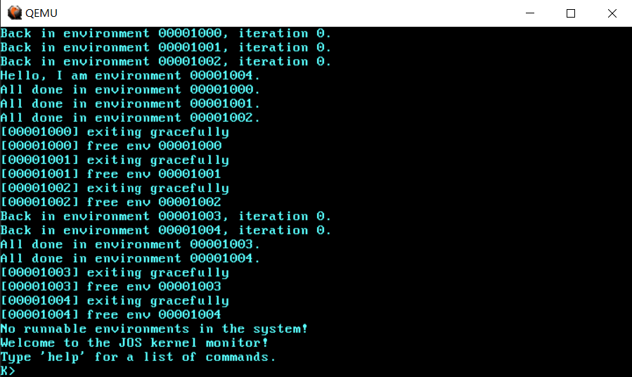

# Lab4-2

## Part A: Multiprocessor Support and Cooperative Multitasking

### Locking

spinlock 的实现要点：

- `xchg`指令有两个目的：(1) 把“读出旧值、写入新值”两个操作合二为一，变成一个原子操作, (2) `xchg`会向 CPU 宣告一个 LOCK# 信号锁住总线(486以后大概是锁 cache line + MESI 协议了)，这样就能确保在多处理器系统或多线程竞争的环境下互斥地使用这个内存地址。当`xchg`执行完毕，LOCK# 就会消失。LOCK# 会引起处理器缓存回写到内存，它相当于一个内存栅栏，主要提供3个功能：

	- 确保指令重排序时不会把其后面的指令排到内存栅栏之前的位置，也不会把前面的指令排到内存栅栏的后面；即在执行到内存栅栏这条指令时，在它前面的操作已经全部完成；
	- 强制将对缓存的修改操作立即写入主存 ，利用缓存一致性机制阻止同时修改由两个以上 CPU 缓存的内存区域数据；
	- 如果是写操作，它会导致其他 CPU 中对应的 cache line 无效。

`xchg`实现了内存一致性模型中的**顺序一致性**。顺序一致性指的是，多个处理器在并行执行一组内存读写操作时，所有处理器要维护一个单一的操作次序，即所有处理器看到的操作次序要一致。

如果在实现 spinlock 时对标记变量的读写采用`mov`指令，首先“读出旧值、写入新值”的原子性无法保证，更重要的是，可能因缓存不一致而导致如下问题：

1. CPU1 执行`mov [locked], 1`获得 spinlock 后进入临界区访问临界资源 (这里对变量`locked`的写操作肯定是要先更改cache, 至于是否立即写入主存则取决于变量所在的虚页是采用 write-through 还是 write-back 机制, 对应页表中的属性位)；
2. CPU2 在 CPU1 进入临界区之后执行`mov eax, [locked]`(假设将变量的值读入`eax`)时, CPU2 对应`locked`变量所在内存的 cache line 里的数据还是0, 并且`mov`是从 cache 读取数据, 那么 CPU2 就会认为当前没有其他核心进入临界区, 从而也能获得 spinlock 进入临界区.

如果 CPU1 采用`xchg`读写标记变量，就能通过 LOCK# 信号消除上述因缓存不一致而导致的问题。另外，在指令乱序执行时 LOCK# 起到了内存栅栏的作用，保证了`xchg`前面的指令不会被重排到`xchg`后面、`xchg`后面的指令不会被重排到`xchg`前面，这一点是至关重要的，因为`xchg`后面的指令显然是需要 CPU 获得了 spinlock 后才能执行的，决不能让它们在`xchg`之前（也就是获得 spinlock 之前）执行。

- 为什么`while`循环不能空转，而是要插入一条`pause`指令？(与流水线、分支预测有关，主要目的是优化 CPU 性能，我也不太明白)

参考：

[https://stackoverflow.com/questions/36731166/spinlock-with-xchg-unlocking](https://stackoverflow.com/questions/36731166/spinlock-with-xchg-unlocking)

[https://stackoverflow.com/questions/4725676/how-does-x86-pause-instruction-work-in-spinlock-and-can-it-be-used-in-other-sc](https://stackoverflow.com/questions/4725676/how-does-x86-pause-instruction-work-in-spinlock-and-can-it-be-used-in-other-sc)

[https://stackoverflow.com/questions/12894078/what-is-the-purpose-of-the-pause-instruction-in-x86](https://stackoverflow.com/questions/12894078/what-is-the-purpose-of-the-pause-instruction-in-x86)

最后是C函数声明：
```c
uint32_t xchg(volatile uint32_t *addr, uint32_t newval);
```
`volatile`关键字是被设计用来修饰被不同线程访问和修改的变量。`volatile`提醒编译器它后面所定义的变量随时都有可能改变，因此编译后的程序每次需要存储或读取这个变量的时候，告诉编译器对该变量不做优化，直接从变量内存地址中读取数据，从而可以提供对特殊地址的稳定访问。如果没有`volatile`关键字，则编译器可能优化读取和存储，可能暂时使用寄存器中的值，如果这个变量由别的程序更新了的话，将出现不一致的现象。

事实上，我们对`addr`地址处的变量存取使用的是`xchg`指令，而且这个C函数是直接用汇编实现的，甚至还不是 GNU 内联汇编！所以即使没有`volatile`关键字编译器也做不了那样的优化，这样做只是为了和`xchg`指令组成双保险。

#### 在适当的位置调用`lock_kernel()`/`unlock_kernel()`
- In `i386_init()`, acquire the lock before the BSP wakes up the other CPUs.
- In `mp_main()`, acquire the lock after initializing the AP, and then call `sched_yield()` to start running environments on this AP.
- In `trap()`, acquire the lock when trapped from user mode. To determine whether a trap happened in user mode or in kernel mode, check the low bits of the `tf_cs`.
- In `env_run()`, release the lock *right before* switching to user mode. Do not do that too early or too late, otherwise you will experience races or deadlocks.


#### 其他的修改
Lab3 只有一个 user environment，Lab4 则有多个。为此 6.828 悄悄为我们做了一些代码上的修改，目前仅关注这几个地方：

- `struct Env`添加一个成员：

```c
struct Env {
  ......
  int env_cpunum;           // The CPU that the env is running on.
  ......
};
```

每次调用`env_pop_tf()`的时候记录下 CPU：

```c
void env_pop_tf(struct Trapframe *tf) {
  // Record the CPU we are running on for user-space debugging
  curenv->env_cpunum = cpunum();

  _env_pop_tf(tf);
  panic("iret failed"); /* mostly to placate the compiler */
}
```

内核通过`env_run(e) --> curenv = e --> env_pop_tf(&curenv->env_tf)`完成特权级转移，跳入 user environment。所以在`env_pop_tf()`里把执行`curenv`的 CPU 记录下来。

- `env_destory()`
```c
//
// Frees environment e.
// If e was the current env, then runs a new environment (and does not return
// to the caller).
//
void env_destroy(struct Env *e) {
  // If e is currently running on other CPUs, we change its state to
  // ENV_DYING. A zombie environment will be freed the next time it
  // traps to the kernel.
  if (e->env_status == ENV_RUNNING && curenv != e) {
    e->env_status = ENV_DYING;
    return;
  }

  env_free(e);

  if (curenv == e) {
    curenv = NULL;
    sched_yield();
  }
}
```

- `trap()`

除了我们自己需要添加`lock_kernel()`调用外，还有一些其他的修改：
```c
void trap(struct Trapframe *tf) {
  // The environment may have set DF and some versions
  // of GCC rely on DF being clear
  asm volatile("cld" ::: "cc");

  // Halt the CPU if some other CPU has called panic()
  extern char *panicstr;
  if (panicstr) {
    asm volatile("hlt");
  }

  // Re-aquire the big kernel lock if we were halted in sched_yield()
  if (xchg(&thiscpu->cpu_status, CPU_STARTED) == CPU_HALTED) {
    lock_kernel();
  }

  // Check that interrupts are disabled.  If this assertion
  // fails, DO NOT be tempted to fix it by inserting a "cli" in
  // the interrupt path.
  assert(!(read_eflags() & FL_IF));

  // printf("Incoming TRAP frame at %p\n", tf);

  if ((tf->tf_cs & 3) == 3) {
    // Trapped from user mode.
    // Acquire the big kernel lock before doing any
    // serious kernel work.
    // LAB 4: Your code here.
    lock_kernel();

    assert(curenv);

    // Garbage collect if current environment is a zombie
    if (curenv->env_status == ENV_DYING) {
      env_free(curenv);
      curenv = NULL;
      sched_yield();
    }

    // Copy trap frame (which is currently on the stack)
    // into 'curenv->env_tf', so that running the environment
    // will restart at the trap point.
    curenv->env_tf = *tf;
    // The trapframe on the stack should be ignored from here on.
    tf = &curenv->env_tf;
  }

  // Record that tf is the last real trapframe so
  // print_trapframe can print some additional information.
  last_tf = tf;

  // Dispatch based on what type of trap occurred
  trap_dispatch(tf);

  // If we made it to this point, then no other environment was
  // scheduled, so we should return to the current environment
  // if doing so makes sense.
  if (curenv && curenv->env_status == ENV_RUNNING) {
    env_run(curenv);
  } else {
    sched_yield();
  }
}
```

对于`trap()`的疑问：如果`curenv->env_status == ENV_DYING`，那么它是如何进入`trap()`的？

目前一个 environment 通过调用`exit() --> sys_env_destory(0)`进行自毁时，是不可能出现`env_destory(e)`把`e->env_status`设置成`ENV_DYING`的情形的——在`env_destory(e)`里`curenv == e`总是成立。这可能需要等到后面涉及*fork*时才会出现，毕竟*zombie*的概念是出现在“子进程先于父进程退出，而父进程又没有回收子进程”的情形里。

另外，对`last_tf`的使用我目前也不太清楚，这与 page fault 有关，后续再分析。

#### Round-Robin Scheduling
实现`sched_yield()`，位于`kernel/sched.c`:

```c
// Choose a user environment to run and run it.
void sched_yield() {
  struct Env *idle;

  // Implement simple round-robin scheduling.
  //
  // Search through 'envs' for an ENV_RUNNABLE environment in
  // circular fashion starting just after the env this CPU was
  // last running.  Switch to the first such environment found.
  //
  // If no envs are runnable, but the environment previously
  // running on this CPU is still ENV_RUNNING, it's okay to
  // choose that environment.
  //
  // Never choose an environment that's currently running on
  // another CPU (env_status == ENV_RUNNING). If there are
  // no runnable environments, simply drop through to the code
  // below to halt the cpu.

  // LAB 4: Your code here.
  int i;
  for (i = 0; i < NENV; i++) {
    if (envs[i].env_status == ENV_RUNNABLE) {
      env_run(&envs[i]);
      panic("env_run should not return");
    }
  }
  if (curenv && curenv->env_status == ENV_RUNNING) {
    env_run(curenv);
    panic("env_run should not return");
  }

  // sched_halt never returns
  sched_halt();
}
```

按照注释实现即可。`sched_halt()`直接从6.828抄过来。`sched_halt()`不能直接无条件唤起 kernel monitor，因为可能还有其他 CPU 上的 environments 在运行，那样可能导致它们阻塞在 big kernel lock 上而无法进行系统调用。

如何调度 user environments? 在哪些位置调用`sched_yield()`?

- BSP, 即 CPU0: `i386_init()`末尾
- APs, 即 CPU1~*: `mp_main()`末尾
- `env_destory()`和`trap()`里的几个位置

这样一来，多个 environments 就可以在多个 CPU 上并行执行。如果没有可供调度的 environments 就通过`sched_halt()`启动一个 kernel monitor。

**最后需要实现一个用户层的系统调用`sys_sched()`**，user environments 通过它来主动让出 CPU。用户层接口见`lib/syscall.c`，内核实现见`kernel/syscall.c`:

```c
// Deschedule current environment and pick a different one to run.
static void sys_yield() { sched_yield(); }
```

```c
// Dispatches to the correct kernel function, passing the arguments.
int32_t syscall(uint32_t syscallno, uint32_t a1, uint32_t a2, uint32_t a3, uint32_t a4, uint32_t a5) {

  switch (syscallno) {
    .......
    case SYS_yield:
      sys_yield();
      return 0;
    default:
      return -E_INVAL;
  }
}
```

最后是测试用的 environment, 实现在`user/yield.c`。在`i386_init()`里创建若干个`user_yield`，再`make qemu CPUS=4`就可以了：



全部 environments 都"exiting gracefully"了。

**Question 3 & 4**

3. In your implementation of `env_run()` you should have called `lcr3()`. Before and after the call to `lcr3()`, your code makes references (at least it should) to the variable `e`, the argument to `env_run`. Upon loading the `%cr3` register, the addressing context used by the MMU is instantly changed. But a virtual address (namely `e`) has meaning relative to a given address context--the address context specifies the physical address to which the virtual address maps. Why can the pointer `e` be dereferenced both before and after the addressing switch?
  内存布局参见`include/memlayout.h`。`UTOP`之上的虚拟地址映射在内核和用户进程的页表中都是一致的。`envs`结构体数组的虚拟地址是`UENVS`，在`UTOP`之上，所以`env_run()`的参数`e`在调用`lcr3()`切换页目录前后都映射到相同的物理地址。

4. Whenever the kernel switches from one environment to another, it must ensure the old environment's registers are saved so they can be restored properly later. Why? Where does this happen?
  用户进程陷入内核的时候要保存现场。`curenv`指向当前 CPU (获得 kernel lock 进入内核临界区的 CPU) 正在运行的用户进程的`struct Env`结构体。保存现场的代码位于`trap_handler`和`trap()`：

- `trap_handler`
```
%macro trap_handler 1
    push   %1
    push   ds
    push   es
    pushad

    mov   ax, ss ; ss == GD_KD
    mov   ds, ax
    mov   es, ax

    push  esp
    call  trap
%endmacro
```

- `trap()`
```c
  // Copy trap frame (which is currently on the stack)
  // into 'curenv->env_tf', so that running the environment
  // will restart at the trap point.
  curenv->env_tf = *tf;
```