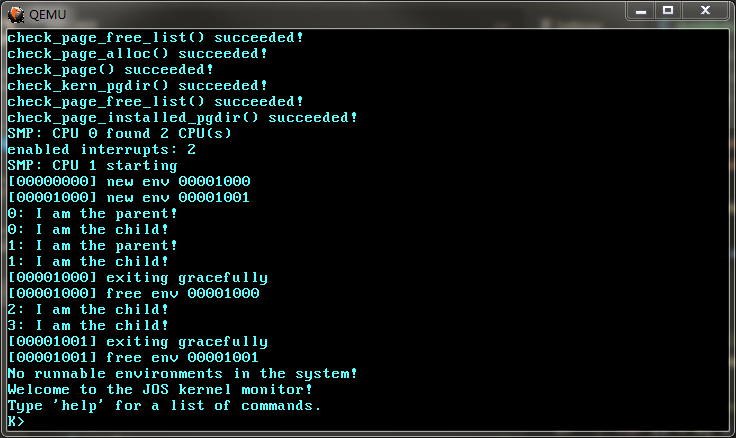
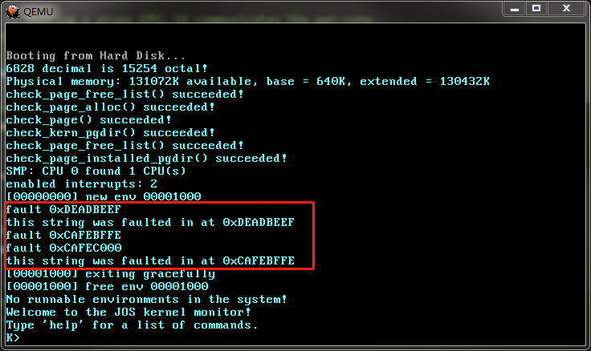
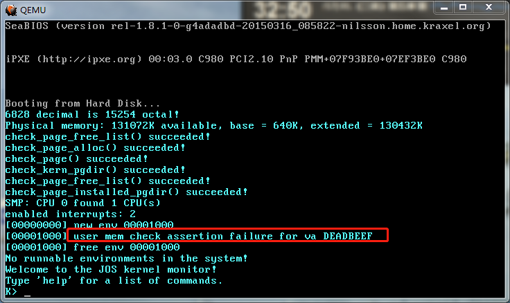
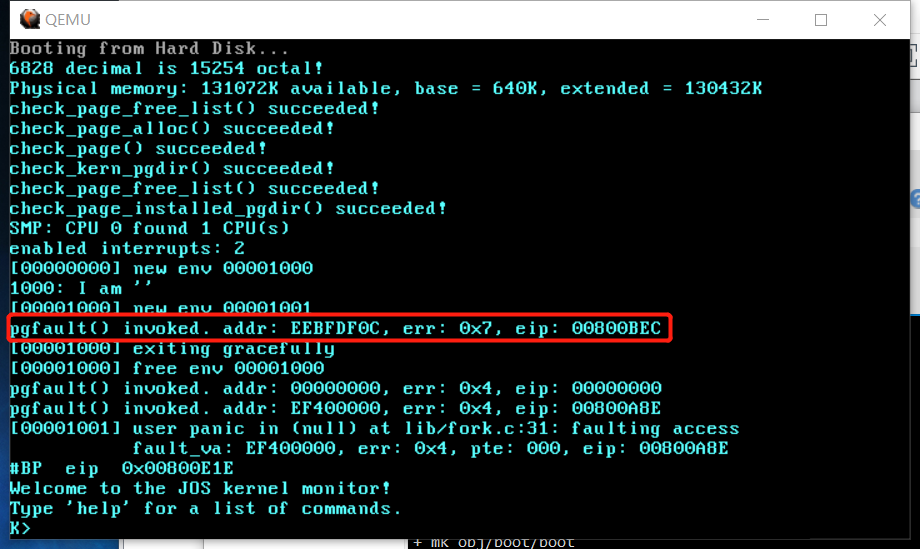
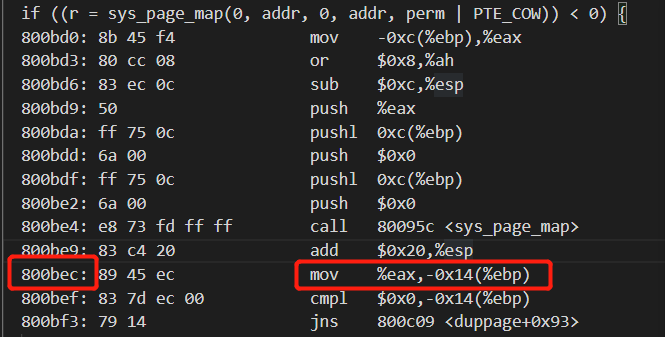
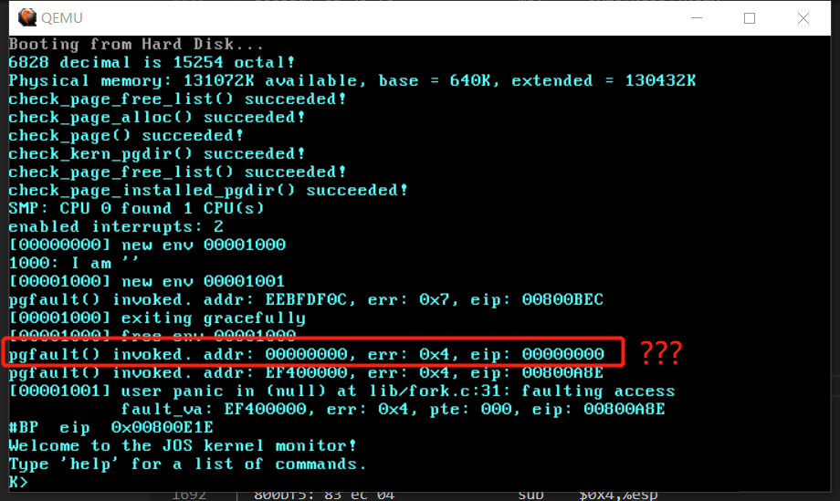

# Lab4-3

## Part A: Multiprocessor Support and Cooperative Multitasking

### System Calls for Environment Creation

- `sys_exofork`
- `sys_env_set_status`
- `sys_page_alloc`
- `sys_page_map`
- `sys_page_unmap`

`user/dumbfork`从 6.828 拷贝过来即可，我在其中加了一些注释。最后是运行结果：



### User-level page fault handling

`struct Env`有多了一个新成员：

```c
struct Env {
  ......
  // Exception handling
  void *env_pgfault_upcall;  // Page fault upcall entry point
};
```

#### Setting the Page Fault Handler
It's easy to implement `sys_env_pgfault_upcall`:

```c
static int sys_env_set_pgfault_upcall(envid_t envid, void *func) {
  // LAB 4: Your code here.

  struct Env *e;
  int r;

  if ((r = envid2env(envid, &e, true)) < 0) {
    return r;
  }

  e->env_pgfault_upcall = func;
  return 0;
}
```

#### Invoking the User Page Fault Handler
修改位于`kernel/trap.c`的`page_fault_handler()`，实现对 user-mode page fault 的处理：

```c
void page_fault_handler(struct Trapframe *tf) {
  ......

  // LAB 4: Your code here.

  struct UTrapframe *utf;
  int r;

  if (curenv->env_pgfault_upcall == NULL) {
    goto bad;
  }

  // 这样写也没问题, 检查整个 exception stack 的内存. 但是无法通过 user/faultnostack 测试,
  // 测试程序希望我们给出的 fault va 是一个 0xeebfffXX 这样的地址. 0xeebfffXX 这个地址很
  // 接近 UXSTACKTOP, 而我们布置 UTrapframe 也是从栈顶开始的, 因为要符合栈从高地址向低地址
  // 生长的特点. 所以, 测试程序希望我们给出的 fault va 就是 UTrapframe 的起始地址.
  // user_mem_assert(curenv, (const void *)(UXSTACKTOP - PGSIZE), PGSIZE, PTE_P | PTE_U | PTE_W);

  if (tf->tf_esp >= UXSTACKTOP - PGSIZE && tf->tf_esp < UXSTACKTOP) {
    utf = (struct UTrapframe *)(tf->tf_esp - 4 - sizeof(struct UTrapframe));
  } else {
    utf = (struct UTrapframe *)(UXSTACKTOP - sizeof(struct UTrapframe));
  }
  user_mem_assert(curenv, utf, sizeof(struct UTrapframe), PTE_P | PTE_U | PTE_W);

  utf->utf_fault_va = fault_va;
  utf->utf_err = T_PGFLT;
  utf->utf_regs = tf->tf_regs;
  utf->utf_eip = tf->tf_eip;
  utf->utf_eflags = tf->tf_eflags;
  utf->utf_esp = tf->tf_esp;

  curenv->env_tf.tf_eip = (uintptr_t)(curenv->env_pgfault_upcall);
  curenv->env_tf.tf_esp = (uintptr_t)utf;
  env_run(curenv);

bad:
  // Destroy the environment that caused the fault.
  printf("[%08x] user fault va %08x ip %08x\n", curenv->env_id, fault_va, tf->tf_eip);
  print_trapframe(tf);
  env_destroy(curenv);
}
```

按照注释提示，首先进行一些检查，然后开始在 Exception Stack 上面布置一个`struct UTrapframe`，结构如下：

```c
struct UTrapframe {
  /* information about the fault */
  uint32_t utf_fault_va; /* va for T_PGFLT, 0 otherwise */
  uint32_t utf_err;
  /* trap-time return state */
  struct PushRegs utf_regs;
  uintptr_t utf_eip;
  uint32_t utf_eflags;
  /* the trap-time stack to return to */
  uintptr_t utf_esp;
} __attribute__((packed));
```

如果 user environment 在正常执行过程中发生 #PF，那么`tf->tf_esp`位于 Normal Stack 范围内，即`[UXSTACKTOP-PGSIZE, UXSTACKTOP-1]`。此时我们需要在`UXSTACKTOP`之下布置一个`struct UTrapframe`：

```
[高地址]
                    <-- UXSTACKTOP
trap-time esp
trap-time eflags
trap-time eip
trap-time eax       start of struct PushRegs
trap-time ecx
trap-time edx
trap-time ebx
trap-time esp
trap-time ebp
trap-time esi
trap-time edi       end of struct PushRegs
tf_err (error code)
fault_va            <-- %esp when handler is run

[低地址]
```

所以要这样设置`utf`指针：

```c
utf = (struct UTrapframe *)(UXSTACKTOP - sizeof(struct UTrapframe));
```

才能正确地填充数据。

为什么一定要把`UTrapframe`刚好布置在`UXSTACKTOP`之下？因为栈是从高地址向低地址方向生长的。这么做相当于向 Exception Stack 里面"push"一个`UTrapframe`，而栈指针的初值为`UXSTACKTOP`。

完成上述工作后需要转移到 user environment 注册的*page fault handler entrypoint*，此时会发生 ring0 到 ring3 的特权级转移，借助`env_run()`实现：

```c
  curenv->env_tf.tf_eip = (uintptr_t)(curenv->env_pgfault_upcall);
  curenv->env_tf.tf_esp = (uintptr_t)utf;
  env_run(curenv);
```

**注意：** `env_tf.tf_eip`和`env_tf.tf_esp`被修改了之后如何返回 user environment 触发 #PF 的位置重新执行？事实上`trap-time eip、eflags、esp`已经被保存到之前在 Exception Stack 上布置的`UTrapframe`里面了，后面会从 Exception Stack 上返回。

借助`env_run()`会跳转到`_pgfault_upcall`，位于`lib/pfentry.asm`：

```
_pgfault_upcall:
    ; call the C page fault handler
    push  esp                     ; function argument: pointer to UTrapframe
    mov   eax, [_pgfault_handler]
    call  eax
    add   esp, 4                  ; pop function argument

    ; Now the C page fault handler has returned and you must return
    ; to the trap time state.
    ; Push trap-time %eip onto the trap-time stack.
    ;
    ; LAB 4: Your code here.
    mov  eax, [esp + 40]    ; %eax <- trap-time %eip
    mov  ebx, [esp + 48]    ; %ebx <- trap-time %esp
    mov  [ebx - 4], eax     ; "push" trap-time %eip onto the trap-time stack

    ; Restore the trap-time registers.  After you do this, you
    ; can no longer modify any general-purpose registers.
    ; LAB 4: Your code here.
    add  esp, 8             ; skip utf_fault_va and utf_err
    popa                    ; restore general-purpose registers from utf_regs

    ; Restore eflags from the stack.  After you do this, you can
    ; no longer use arithmetic operations or anything else that
    ; modifies eflags.
    ; LAB 4: Your code here.
    add  esp, 4             ; skip utf_eip
    popf                    ; restore eflags from the stack

    ; Switch back to the adjusted trap-time stack.
    ; LAB 4: Your code here.
    pop  esp                ; pop utf_esp into %esp

    ; Return to re-execute the instruction that faulted.
    ; LAB 4: Your code here.
    sub  esp, 4
    ret
```

刚进入`_pgfault_upcall`时的栈帧：

```
[高地址]
/* +48 */ trap-time esp
/* +44 */ trap-time eflags
/* +40 */ trap-time eip
/* +36 */ utf_regs.reg_eax
          ...
/* +12 */ utf_regs.reg_esi
/* +8  */ utf_regs.reg_edi
/* +4  */ utf_err (error code)
/* +0  */ utf_fault_va            <-- %esp
[低地址]
```

这就是之前布置好的`UTrapframe`。`push esp`压入栈的就是这个`UTrapframe`的指针(栈向低地址方向生长，`push`不会破环这个`UTrapframe`)，然后`call eax`跳转到 C 函数`_pgfault_handler`(`lib/pgfault.c`)。C 函数返回后`add esp, 4`将`esp`退回原先的位置，之后便可根据偏移量访问`UTrapframe`里的各个成员。

**1. Push trap-time `%eip` onto the trap-time stack.**

目前处在 Exception Stack，而 trap-time stack 可能是 Normal Stack 或 Exception Stack——总之不能直接用`push`指令进行这里的"push"。必须把 trap-time esp 先取到`ebx`里面，再把 trap-time eip 写到`[ebx-4]`——为什么要`-4`？因为`push xxx`可以分解为：

```
 (1) sub esp, 4
 (2) mov [esp], xxx
```

所以要模拟`push`指令的动作就必须`-4`，否则直接`mov [ebx], eax`会破坏掉 trap-time stack 上面的数据。

**2. Restore the trap-time registers.**

`add esp, 8`跳过`utf_fault_va`和`utf_err`，方能`popa`.

**3. Restore eflags from the stack.**

上一条指令`popa`之后`esp`指向 trap-time eip，所以需要`add esp, 4`跳过之，使得`esp`指向 trap-time eflags，然后`popf`将其弹入`eflags`.

**4. Switch back to the adjusted trap-time stack.**

当`esp`指向 trap-time esp 时执行`pop esp`即可切换到 trap-time stack.

**5. Return to re-execute the instruction that faulted.**

这一步需要把 trap-time eip 打到`eip`里面。当前的`esp`即为 trap-time esp，而在`esp-4`这个地址上的 32-bit word 就是第一步里保存进去的 trap-time eip. 首先`sub esp,4`，然后`ret`把 trap-time eip 打到`eip`里就完成可转移。`ret`相当于`pop eip`，所以`esp`也被**同时**重新调整为 trap-time esp 了。——这就是**Exercise 10**要求我们做的：*The hard part is simultaneously switching stacks and re-loading the EIP.*


现在再来分析这个问题：

*If the user environment is already running on the user exception stack when an exception occurs, then the page fault handler itself has faulted. In this case, you should start the new stack frame just under the current `tf->tf_esp` rather than at `UXSTACKTOP`. You should first push an empty 32-bit word, then a `struct UTrapframe`.*

*To test whether `tf->tf_esp` is already on the user exception stack, check whether it is in the range between `UXSTACKTOP-PGSIZE` and `UXSTACKTOP-1`, inclusive.*

此时我们不能把`UTrapframe`布置在`UXSTACKTOP`之下——因为那里已经有一个`UTrapframe`了。我们在 Exception Stack 范围内再布置一个`UTrapframe`，具体位置就在`tf->tf_esp`之下，但不能紧贴着`tf->tf_esp`，因为我们需要保留一个 32-bit word —— 后面会把 trap-time eip 保存到`tf->tf_esp-4`这个地址上。所以在`page_fault_handler()`里这么写：

```c
if (tf->tf_esp >= UXSTACKTOP - PGSIZE && tf->tf_esp < UXSTACKTOP) {
  utf = (struct UTrapframe *)(tf->tf_esp - 4 - sizeof(struct UTrapframe));
}
```

最后的栈帧：

```
[高地址]
  ┌─────────────────────┐
  │                     │  <-- tf->tf_esp
  ├─────────────────────┤
  │    32-bit word      │
  ├─────────────────────┤
  │                     │
  │                     │
  │     UTrapframe      │
  │                     │
  │                     │
  └─────────────────────┘
[低地址]
```

#### 测试
1. `user/faultalloc`



2. `user/faultallocbad`



输出结果和 6.828 预期的一致。来自 6.828 对`user/faultallocbad`的提问：*alloc pages to fix faults doesn't work because we `sys_cputs` instead of `cprintf` (exercise: why?)*

`printf("%s\n", (char *)fault_va)`打印`fault_va`地址上的字符串时，存在一个从`fault_va`拷贝字符串到 buffer 的过程——此时会触发 #PF，然后用户程序的 page fault handler 就会被调用，完成相应的处理。最后才会调用`sys_puts`打印 buffer 里的内容。

`sys_puts((char *)fault_va, 4)`进入内核后是这样做的：

```c
static void sys_puts(const char *s, size_t len) {
  // Check that the user has permission to read memory [s, s+len).
  // Destroy the environment if not.

  // LAB 3: Your code here.
  user_mem_assert(curenv, s, len, 0);

  // Print the string supplied by the user.
  printf("%.*s", len, s);
}
```

直接对`fault_va`调用`user_mem_assert`进行检查，此时 #PF 尚未被触发，用户程序的 page fault handler 也未被调用，所以检查就会失败。

#### BUG

`user/faultregs`测试失败，测试结果表明从 #PF 返回到用户程序后`eflags`寄存器的值未被正确恢复。回顾`_pgfault_upcall`，可以看到我在`popf`指令之后执行了一条算数指令`sub esp,4`，破坏了`eflags`的值。

解决方法如下：

```
_pgfault_upcall:
    ; call the C page fault handler
    push  esp                     ; function argument: pointer to UTrapframe
    mov   eax, [_pgfault_handler]
    call  eax
    add   esp, 4                  ; pop function argument

    ; Now the C page fault handler has returned and you must return
    ; to the trap time state.
    ; Push trap-time %eip onto the trap-time stack.
    ;
    ; LAB 4: Your code here.
    mov  eax, [esp + 40]    ; %eax <- trap-time %eip
    mov  ebx, [esp + 48]    ; %ebx <- trap-time %esp
    sub  ebx, 4
    mov  [ebx], eax         ; "push" trap-time %eip onto the trap-time stack
    mov  [esp + 48], ebx

    ; Restore the trap-time registers.  After you do this, you
    ; can no longer modify any general-purpose registers.
    ; LAB 4: Your code here.
    add  esp, 8             ; skip utf_fault_va and utf_err
    popa                    ; restore general-purpose registers from utf_regs

    ; Restore eflags from the stack.  After you do this, you can
    ; no longer use arithmetic operations or anything else that
    ; modifies eflags.
    ; LAB 4: Your code here.
    add  esp, 4             ; skip utf_eip
    popf                    ; restore eflags from the stack

    ; Switch back to the adjusted trap-time stack.
    ; LAB 4: Your code here.
    pop  esp                ; pop utf_esp into %esp

    ; Return to re-execute the instruction that faulted.
    ; LAB 4: Your code here.
    ret
```

既然不能在`pop esp`之后再`sub esp,4`，那么只能使得`pop esp`之后`esp`就是我们想要的。方法是在`_pgfault_upcall`开始的位置修改`UTrapframe`里的*trap-time esp*。

### Implementing Copy-on-Write Fork

有一点很关键：

*For each writable or copy-on-write page in its address space below `UTOP`, the parent calls `duppage`, which should map the page copy-on-write into the address space of the child and then remap the page copy-on-write in its own address space.*

对于 parent 的 writable page，remap 的时候不是在原有的权限位基础上“或”上`PTE_COW`，而是修改权限位为`PTE_P|PTE_U|PTE_COW`。

*`duppage` sets both PTEs so that the page is not writeable, and to contain `PTE_COW` in the "avail" field...*

这里的“both”指的就是 parent 和 child。

以下是`duppage`的实现：

```c
static int duppage(envid_t envid, void *addr) {
  int r;

  // LAB 4: Your code here.

  // Map the page copy-on-write into the address space of the child and
  // then remap the page copy-on-write in its own address space.

  if (!PAGE_ALGINED(addr)) {
    panic("addr %08x not page-aligned", addr);
  }

  pte_t pte = uvpt[PGNUM(addr)];
  int perm = PTE_P | PTE_U;

  if ((pte & PTE_W) || (pte & PTE_COW)) {
    perm |= PTE_COW;
  }

  if ((r = sys_page_map(0, addr, envid, addr, perm)) < 0) {
    panic("sys_page_map");
  }

  if ((r = sys_page_map(0, addr, 0, addr, perm | PTE_COW)) < 0) {
    panic("sys_page_map");
  }

  return 0;
}
```

我们知道，父进程的栈原本是“可写”的（假设父进程的栈所在的 page 是 *Page_A*），当`duppage`把父进程的栈的写权限拿掉之后会发生什么？届时函数执行过程中的栈操作将触发父进程调用`fork`过程中的第一次 #PF，从而执行第一次 Copy-on-Write，*Page_A* 就会有一个可写的副本 *Page_A'*。由于子进程的栈也是映射到 *Page_A*，所以当子进程执行栈操作指令时也会触发 #PF，然后执行 Copy-on-Write 的时候又会产生 *Page_A* 的一个可写副本 *Page_A''*。这样一来 *Page_A* 就被浪费掉了。

6.828 让我们思考：

*The ordering here (i.e., marking a page as COW in the child before marking it in the parent) actually matters! Can you see why? Try to think of a specific case where reversing the order could cause trouble.*

也就说如果像下面这样实现`duppage`会有什么问题：

```c
static int duppage(envid_t envid, void *addr) {
  int r;

  // LAB 4: Your code here.

  // Map the page copy-on-write into the address space of the child and
  // then remap the page copy-on-write in its own address space.

  if (!PAGE_ALGINED(addr)) {
    panic("addr %08x not page-aligned", addr);
  }

  pte_t pte = uvpt[PGNUM(addr)];
  int perm = PTE_P | PTE_U;

  if ((pte & PTE_W) || (pte & PTE_COW)) {
    perm |= PTE_COW;
  }

  if ((r = sys_page_map(0, addr, 0, addr, perm | PTE_COW)) < 0) {
    panic("sys_page_map");
  }

  if ((r = sys_page_map(0, addr, envid, addr, perm)) < 0) {
    panic("sys_page_map");
  }

  return 0;
}
```

为了简化分析，先修改`user/forktree.c`，注释掉第二次`forkchild()`调用，否则输出的内容太多：

```c
void forktree(const char *cur) {
  printf("%04x: I am '%s'\n", sys_getenvid(), cur);

  forkchild(cur, '0');
  // forkchild(cur, '1');
}
```

运行结果如下：



触发了 user panic，这不是正常现象。红框标出了第一次 #PF 发生时的`eip`为`00800BEC`，到`obj/user/forktree.objdump`里找到它：



该指令是`sys_page_map()`返回后的第一条向栈内存写数据的指令，而此时父进程的栈已经没有写权限了，所以触发了#PF，就如前文分析的一样。问题是第二次 #PF 发生时`eip`的值为什么变成0了？



由于 id 为`00001000`的父进程已经"existing gracefully"并且已被释放，所以这个 #PF 只能来自 id 为`00001001`的子进程。

以下是 gdb 调试分析的过程：

```
// 会不会是创建子进程时将父进程的上下文拷贝给子进程时出错了？
// 在 sys_exofork 处打断点看看：

Breakpoint 1, sys_exofork () at kernel/syscall.c:76
76	  e->env_status = ENV_NOT_RUNNABLE;
gdb-peda$ p curenv                            <= 查看当前进程(父进程)的 Env 结构
$1 = (struct Env *) 0xf022e000
gdb-peda$ p *curenv
$2 = {
  env_tf = {
    tf_regs = {
      reg_edi = 0x0,
      reg_esi = 0x0,
      reg_ebp = 0xeebfdf30,
      reg_oesp = 0xefffffdc,
      reg_ebx = 0x0,
      reg_edx = 0x0,
      reg_ecx = 0x0,
      reg_eax = 0x5
    },
    tf_es = 0x23,
    tf_padding1 = 0x0,
    tf_ds = 0x23,
    tf_padding2 = 0x0,
    tf_trapno = 0x30,
    tf_err = 0x0,
    tf_eip = 0x800a1a,
    tf_cs = 0x1b,
    tf_padding3 = 0x0,
    tf_eflags = 0x82,
    tf_esp = 0xeebfdf04,
    tf_ss = 0x23,
    tf_padding4 = 0x0
  },
  env_link = 0xf022e068,
  env_id = 0x1000,
  env_parent_id = 0x0,
  env_type = ENV_TYPE_USER,
  env_status = 0x3,
  env_runs = 0x6,
  env_cpunum = 0x0,
  env_pgdir = 0xf03bb000,
  env_pgfault_upcall = 0x800ea0
}
gdb-peda$ n
=> 0xf0101834 <sys_exofork+67>:	mov    ebx,DWORD PTR [ebp-0x20]
77	  e->env_tf = curenv->env_tf;            <= 将父进程的上下文拷贝给子进程
gdb-peda$ n
=> 0xf0101857 <sys_exofork+102>:	mov    eax,DWORD PTR [ebp-0x20]
78	  e->env_tf.tf_regs.reg_eax = 0;  // return value is stored in eax
gdb-peda$ n
=> 0xf0101861 <sys_exofork+112>:	mov    eax,DWORD PTR [ebp-0x20]
79	  return e->env_id;
gdb-peda$ p *e                               <= 查看子进程的 Env 结构
$3 = {
  env_tf = {
    tf_regs = {
      reg_edi = 0x0,
      reg_esi = 0x0,
      reg_ebp = 0xeebfdf30,
      reg_oesp = 0xefffffdc,
      reg_ebx = 0x0,
      reg_edx = 0x0,
      reg_ecx = 0x0,
      reg_eax = 0x0
    },
    tf_es = 0x23,
    tf_padding1 = 0x0,
    tf_ds = 0x23,
    tf_padding2 = 0x0,
    tf_trapno = 0x30,
    tf_err = 0x0,
    tf_eip = 0x800a1a,
    tf_cs = 0x1b,
    tf_padding3 = 0x0,
    tf_eflags = 0x82,
    tf_esp = 0xeebfdf04,
    tf_ss = 0x23,
    tf_padding4 = 0x0
  },
  env_link = 0xf022e0d0,
  env_id = 0x1001,
  env_parent_id = 0x1000,
  env_type = ENV_TYPE_USER,
  env_status = 0x4,
  env_runs = 0x0,
  env_cpunum = 0x0,
  env_pgdir = 0xf03b1000,
  env_pgfault_upcall = 0x0
}

// 可以看到，子进程的 tf_eip 是正确的值：0x800a1a
// 那么它是什么时候变为0的？打一个硬件断点监控子进程的 tf_eip 何时被修改为0：

gdb-peda$ p &e->env_tf.tf_eip
$4 = (uintptr_t *) 0xf022e098
gdb-peda$ watch *(int*)0xf022e098
Hardware watchpoint 2: *(int*)0xf022e098
gdb-peda$ c
Continuing.
=> 0xf010640a <trap+275>:	rep movs DWORD PTR es:[edi],DWORD PTR ds:[esi]

Hardware watchpoint 2: *(int*)0xf022e098

Old value = 0x800a1a
New value = 0x0
0xf010640a in trap (tf=0xefffffbc) at kernel/trap.c:276      <= 此时子进程的 tf_eip 被修改为0
276	    curenv->env_tf = *tf;
gdb-peda$ p *tf
$5 = {
  tf_regs = {
    reg_edi = 0x0,
    reg_esi = 0x0,
    reg_ebp = 0xeebfdf30,
    reg_oesp = 0xefffffdc,
    reg_ebx = 0x0,
    reg_edx = 0x0,
    reg_ecx = 0x0,
    reg_eax = 0x0
  },
  tf_es = 0x23,
  tf_padding1 = 0x0,
  tf_ds = 0x23,
  tf_padding2 = 0x0,
  tf_trapno = 0xe,
  tf_err = 0x4,
  tf_eip = 0x0,           <= 为什么 tf->tf_eip 会是0？
  tf_cs = 0x1b,
  tf_padding3 = 0x0,
  tf_eflags = 0x82,
  tf_esp = 0xeebfdf08,
  tf_ss = 0x23,
  tf_padding4 = 0x0
}
gdb-peda$ p *curenv      <= 查看被修改后的子进程 Env 结构体
$6 = {
  env_tf = {
    tf_regs = {
      reg_edi = 0x0,
      reg_esi = 0x0,
      reg_ebp = 0xeebfdf30,
      reg_oesp = 0xefffffdc,
      reg_ebx = 0x0,
      reg_edx = 0x0,
      reg_ecx = 0x0,
      reg_eax = 0x0
    },
    tf_es = 0x23,
    tf_padding1 = 0x0,
    tf_ds = 0x23,
    tf_padding2 = 0x0,
    tf_trapno = 0xe,
    tf_err = 0x4,
    tf_eip = 0x0,
    tf_cs = 0x1b,
    tf_padding3 = 0x0,
    tf_eflags = 0x82,
    tf_esp = 0xeebfdf04,
    tf_ss = 0x23,
    tf_padding4 = 0x0
  },
  env_link = 0xf022e0d0,
  env_id = 0x1001,
  env_parent_id = 0x1000,
  env_type = ENV_TYPE_USER,
  env_status = 0x3,
  env_runs = 0x1,
  env_cpunum = 0x0,
  env_pgdir = 0xf03b1000,
  env_pgfault_upcall = 0x800ea0
}
gdb-peda$ bt
#0  0xf010640a in trap (tf=0xefffffbc) at kernel/trap.c:276
#1  0xf0106784 in page_fault ()
#2  0xefffffbc in ?? ()
Backtrace stopped: previous frame inner to this frame (corrupt stack?)
gdb-peda$
```

最后，`trap()`被调用时`tf->tf_eip`已经为0了. `tf->tf_eip`是发生中断时由处理器压入栈的. 所以可以断定, 子进程在执行过程中`eip`意外地变为0.

哪些指令可以修改`eip`? 可以猜测是`ret`, 那么就和栈有关了. 应该是子进程的栈被父进程修改了.

考虑以下情形：对于 Writable Page A, 如果父进程先把自己对它的权限变成 COW, 再将 Page A 以 COW 权限映射给子进程, 在两次操作间隔内如果父进程向 Page A 写入, 就会触发#PF, 引发 COW 流程, 导致父进程的地址映射关系发生改变：假如原来的地址 VA 映射到 Page A, COW 流程之后 VA 就会映射到 Page A'. 在这之后如果再去按照原本的想法将 Page A 以 COW 权限映射给子进程, 这可以成功吗? 肯定是不行的, 因为 VA 已经不再映射到 Page A 了, 而是映射到 Page A', 那里面已经包含了父进程的所做的修改——子进程是不应该看到这些修改的, 子进程希望在自己的地址空间内 VA 仍是映射到 Page A 而不是 Page A'.

如果上述的 Writable Page A 是父进程的栈, 就容易知道为什么子进程的`eip`会跑到`0x00000000`了：当`esp`所指向的内存里的内容是`0x00000000`, 此时执行`ret`指令会发生什么呢，不言而喻。

`duppage`的注释里有一个问题：

*Exercise: Why do we need to mark ours copy-on-write again if it was already copy-on-write at the beginning of this function?*

意思是说，如果父进程的一个 page 已经被标记为 COW，那么是否还需要重新映射一遍？肯定是需要的，因为不能确定父进程的这个 page 除了 COW 属性外是否没有写权限. 重新映射的目的就是要拿掉父进程对 page 的写权限，以免影响到子进程，从而导致前面的那个问题。

#### 插曲: `page_insert()`的BUG
实现 copy-on-write fork 时发现`page_insert()`存在BUG，修改如下：

```c
int page_insert(pde_t *pgdir, struct PageInfo *pp, void *va, int perm) {
  // Fill this function in
  pte_t *ppte;

  ppte = pgdir_walk(pgdir, va, true);
  if (ppte == NULL) {
    return -E_NO_MEM;
  }

  pp->pp_ref++;

  if (*ppte & PTE_P) {
    page_remove(pgdir, va);
  }

  // if (*ppte != 0) {
  //   if (PTE_ADDR(*ppte) != page2pa(pp)) {
  //     page_remove(pgdir, va);
  //     pp->pp_ref++;
  //   }
  // } else {
  //   pp->pp_ref++;
  // }

  // 来自 Lab4:
  // normal stack 和 exception stack 的 PTE 位于同一个页表内, 也就是
  // 说它们的 PDE 是相同的. Lab4 实现 copy-on-write fork 时 parent 会
  // 把自己的 normal stack 的写权限(PTE_W)去掉, 取而代之的是 PTE_COW.
  // 此后当 parent 的栈操作指令尝试向 normal stack 写入时就会触发 #PF,
  // 然后进行 copy-on-write. 问题就出在这里! page_fault_handler() 需要
  // 在 exception stack 上面写入一些内容, 而 exception stack 的 PDE 的
  // PTE_W 属性位已经被去掉了, 就会导致 user_mem_assert() 失败.

  // page_insert 是否需要修改PDE? 实际上并不需要, 而且从 Lab4 的情形
  // 来说也不能这么做—— PDE 的控制粒度太大了, 如果我们只需要修改单个
  // page 的权限位, 仅修改 PTE 即可, 不应该牵连到其他的 page.

  // pgdir[PDX(va)] = PTE_ADDR(pgdir[PDX(va)]) | perm | PTE_P;
  *ppte = page2pa(pp) | perm | PTE_P;

  return 0;
}
```

这样的修改也符合注释的提示：

*Corner-case hint: Make sure to consider what happens when the same pp is re-inserted at the same virtual address in the same pgdir. However, try not to distinguish this case in your code, as this frequently leads to subtle bugs; there's an elegant way to handle everything in one code path.*