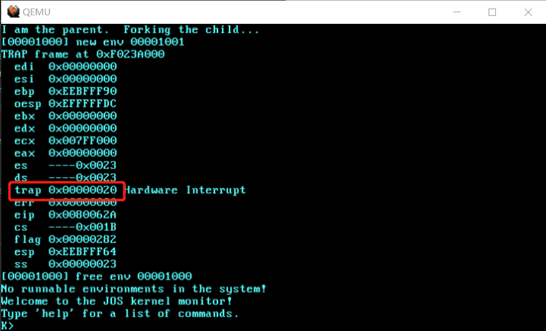

# Lab4-4

## Part C: Preemptive Multitasking and Inter-Process communication (IPC)

### Clock Interrupts and Preemption

#### Interrupt discipline

Initialize the 8259A interrupt controllers:

`kernel/picirq.h`:

```c
#define MAX_IRQS 16  // Number of IRQs

// I/O Addresses of the two 8259A programmable interrupt controllers
#define IO_PIC1 0x20  // Master (IRQs 0-7)
#define IO_PIC2 0xA0  // Slave (IRQs 8-15)

#define IRQ_SLAVE 2  // IRQ at which slave connects to master
```

`kernel/picirq.c`:

```c
// Current IRQ mask.
// Initial IRQ mask has interrupt 2 enabled (for slave 8259A).
uint16_t irq_mask_8259A = 0xFFFF & ~(1 << IRQ_SLAVE);
static bool didinit;

/* Initialize the 8259A interrupt controllers. */
void pic_init(void) {
  didinit = 1;

  // mask all interrupts
  outb(IO_PIC1 + 1, 0xFF);
  outb(IO_PIC2 + 1, 0xFF);

  // Set up master (8259A-1)

  // ICW1:  0001g0hi
  //    g:  0 = edge triggering, 1 = level triggering
  //    h:  0 = cascaded PICs, 1 = master only
  //    i:  0 = no ICW4, 1 = ICW4 required
  outb(IO_PIC1, 0x11);

  // ICW2:  Vector offset
  outb(IO_PIC1 + 1, IRQ_OFFSET);

  // ICW3:  bit mask of IR lines connected to slave PICs (master PIC),
  //        3-bit No of IR line at which slave connects to master(slave PIC).
  outb(IO_PIC1 + 1, 1 << IRQ_SLAVE);

  // ICW4:  000nbmap
  //    n:  1 = special fully nested mode
  //    b:  1 = buffered mode
  //    m:  0 = slave PIC, 1 = master PIC
  //	  (ignored when b is 0, as the master/slave role
  //	  can be hardwired).
  //    a:  1 = Automatic EOI mode
  //    p:  0 = MCS-80/85 mode, 1 = intel x86 mode
  outb(IO_PIC1 + 1, 0x3);

  // Set up slave (8259A-2)
  outb(IO_PIC2, 0x11);                // ICW1
  outb(IO_PIC2 + 1, IRQ_OFFSET + 8);  // ICW2
  outb(IO_PIC2 + 1, IRQ_SLAVE);       // ICW3
  // NB Automatic EOI mode doesn't tend to work on the slave.
  // Linux source code says it's "to be investigated".
  outb(IO_PIC2 + 1, 0x01);  // ICW4

  // OCW3:  0ef01prs
  //   ef:  0x = NOP, 10 = clear specific mask, 11 = set specific mask
  //    p:  0 = no polling, 1 = polling mode
  //   rs:  0x = NOP, 10 = read IRR, 11 = read ISR
  outb(IO_PIC1, 0x68); /* clear specific mask */
  outb(IO_PIC1, 0x0a); /* read IRR by default */

  outb(IO_PIC2, 0x68); /* OCW3 */
  outb(IO_PIC2, 0x0a); /* OCW3 */

  if (irq_mask_8259A != 0xFFFF) {
    irq_setmask_8259A(irq_mask_8259A);
  }
}

void irq_setmask_8259A(uint16_t mask) {
  int i;
  irq_mask_8259A = mask;
  if (!didinit) {
    return;
  }
  outb(IO_PIC1 + 1, (char)mask);
  outb(IO_PIC2 + 1, (char)(mask >> 8));
  printf("enabled interrupts:");
  for (i = 0; i < 16; i++) {
    if (~mask & (1 << i)) {
      printf(" %d", i);
    }
  }
  printf("\n");
}
```


**Exercise 13**. Modify `kern/trapentry.S` and `kern/trap.c` to initialize the appropriate entries in the IDT and provide handlers for IRQs 0 through 15. Then modify the code in `env_alloc()` in `kern/env.c` to ensure that user environments are always run with interrupts enabled.

Also uncomment the `sti` instruction in `sched_halt()` so that idle CPUs unmask interrupts.

1. `kernel/trapentry.asm`

```
; 使用以下脚本生成代码:
;
; #!/bin/bash
;
; for i in $(seq 1 16); do
;   irq_num=$((i-1))
;   echo "irq_${irq_num}:"
;   echo "    push            0"
;   echo "    trap_handler    IRQ_OFFSET+${irq_num}"
;   echo ""
; done

irq_0:
    push            0
    trap_handler    IRQ_OFFSET+0

irq_1:
    push            0
    trap_handler    IRQ_OFFSET+1
......
```

2. `kernel/trap.c`

```c
void trap_init(void) {
  ......
  // 使用以下脚本生成代码：
  //
  // #!/bin/bash
  //
  // for i in $(seq 1 16); do
  //   irq_num=$((i-1))
  //   echo "SETGATE(idt[IRQ_OFFSET+${irq_num}], 0, GD_KT, irq_${irq_num}, 3);"
  // done

  SETGATE(idt[IRQ_OFFSET + 0], 0, GD_KT, irq_0, 3);
  SETGATE(idt[IRQ_OFFSET + 1], 0, GD_KT, irq_1, 3);
  ......
}
```

3. `env_alloc` in `kernel/env.c`

```c
int env_alloc(struct Env **newenv_store, envid_t parent_id) {
  ......
  // Enable interrupts while in user mode.
  // LAB 4: Your code here.
  e->env_tf.tf_eflags = FL_IF;
  ......
}
```

After doing this exercise, if you run your kernel with any test program that runs for a non-trivial length of time (e.g., `spin`), you should see the kernel print trap frames for hardware interrupts. While interrupts are now enabled in the processor, JOS isn't yet handling them, so you should see it misattribute each interrupt to the currently running user environment and destroy it. Eventually it should run out of environments to destroy and drop into the monitor.



`0x20`就是 8259A 时钟中断向量号。`user/spin.c`直接从 6.828 拷贝过来。

#### Handling Clock Interrupts

**Exercise 14.** Modify the kernel's `trap_dispatch()` function so that it calls `sched_yield()` to find and run a different environment whenever a clock interrupt takes place.