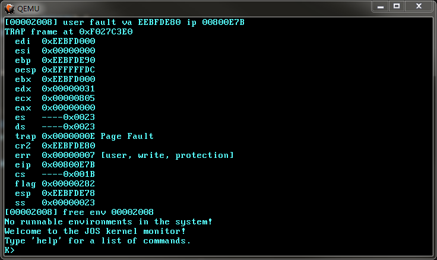
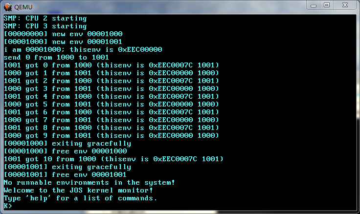

# Lab4-5

## Part C: Preemptive Multitasking and Inter-Process communication (IPC)

### Implementing IPC

Implement `sys_ipc_recv` and `sys_ipc_try_send` in `kern/syscall.c`.

```c
static int sys_ipc_recv(void *dstva) {
  // LAB 4: Your code here.

  if ((uintptr_t)dstva < UTOP) {
    if (!PAGE_ALIGNED(dstva)) {
      return -E_INVAL;
    }
  }

  curenv->env_ipc_recving = true;
  curenv->env_ipc_from = 0;
  curenv->env_ipc_dstva = dstva;
  curenv->env_status = ENV_NOT_RUNNABLE;

  sched_yield();
  return 0;
}

static int sys_ipc_try_send(envid_t envid, uint32_t value, void *srcva, unsigned perm) {
  // LAB 4: Your code here.

  struct Env *e;
  int r;

  if ((r = envid2env(envid, &e, false)) < 0) {
    return r;
  }

  if (!e->env_ipc_recving) {
    return -E_IPC_NOT_RECV;
  }

  if ((uintptr_t)srcva < UTOP) {
    if (!PAGE_ALIGNED(srcva)) {
      return -E_INVAL;
    }
    if (e->env_ipc_dstva != 0) {
      if ((r = sys_page_map_ex(0, srcva, envid, e->env_ipc_dstva, perm, false)) < 0) {
        return r;
      }
    }
  }

  e->env_ipc_recving = false;
  e->env_ipc_from = curenv->env_id;
  e->env_ipc_value = value;
  e->env_ipc_perm = (uintptr_t)srcva < UTOP ? perm : 0;
  e->env_tf.tf_regs.reg_eax = 0;
  e->env_status = ENV_RUNNABLE;

  return 0;
}
```

Then implement the `ipc_recv` and `ipc_send` functions in `lib/ipc.c`.

```c
void ipc_send(envid_t to_env, uint32_t val, void *pg, int perm) {
  // LAB 4: Your code here.

  int r;
  void *va = pg ? pg : (void *)UTOP;

  while ((r = sys_ipc_try_send(to_env, val, va, perm)) < 0) {
    if (r != -E_IPC_NOT_RECV) {
      panic("sys_ipc_try_send");
    }
    sys_yield();
  }
}

int32_t ipc_recv(envid_t *from_env_store, void *pg, int *perm_store) {
  // LAB 4: Your code here.

  int r;
  void *va = pg ? pg : (void *)UTOP;

  if ((r = sys_ipc_recv(va)) < 0) {
    if (from_env_store) {
      *from_env_store = 0;
    }
    if (perm_store) {
      *perm_store = 0;
    }
    return r;
  }

  if (from_env_store) {
    *from_env_store = thisenv->env_ipc_from;
  }
  if (perm_store) {
    *perm_store = thisenv->env_ipc_perm;
  }

  return thisenv->env_ipc_value;
}
```

#### 说明1

系统调用`sys_ipc_recv`会把 receiver 进程标记为`ENV_NOT_RUNNABLE`，最后调用`sched_yield`，从而让 receiver 放弃CPU。当 sender 进程想要给 receiver 发消息时，它会把 receiver 标记为`ENV_RUNNABLE`。之后发生时钟中断时 receiver 就有可能被调度到。那么 receiver 下次被调度时从哪个地方继续执行？receiver 发起系统调用的时候它的上下文被保存在自己的`Trapframe`里面，查看其中内容即可。

首先在`trap_dispatch`的`T_SYSCALL`分支打一个条件断点：

```c
static void trap_dispatch(struct Trapframe *tf) {
  // Handle processor exceptions.
  // LAB 3: Your code here.

  int32_t r;

  switch (tf->tf_trapno) {
    ......
    case T_SYSCALL:
      r = syscall(tf->tf_regs.reg_eax, tf->tf_regs.reg_edx, tf->tf_regs.reg_ecx, tf->tf_regs.reg_ebx,
                  tf->tf_regs.reg_edi, tf->tf_regs.reg_esi);
      tf->tf_regs.reg_eax = r;
      return;
  }
  ......
```

GDB命令：

```
symbol-file obj/kernel/kernel
b kernel/trap.c:252
condition 1 tf->tf_regs.regs_eax==12
```

注意`SYS_ipc_recv=12`

然后查看`tf_eip`:

```
gdb-peda$ p tf->tf_eip
$2 = 0x80069c
```

打开用户进程的反汇编，以`obj/user/primes.objdump`为例，找到`0x80069c`：

```
00800680 <syscall>:
  800680:	55                   	push   %ebp
  800681:	89 e5                	mov    %esp,%ebp
  800683:	52                   	push   %edx
  800684:	51                   	push   %ecx
  800685:	57                   	push   %edi
  800686:	56                   	push   %esi
  800687:	53                   	push   %ebx
  800688:	8b 45 08             	mov    0x8(%ebp),%eax
  80068b:	8b 55 0c             	mov    0xc(%ebp),%edx
  80068e:	8b 4d 10             	mov    0x10(%ebp),%ecx
  800691:	8b 5d 14             	mov    0x14(%ebp),%ebx
  800694:	8b 7d 18             	mov    0x18(%ebp),%edi
  800697:	8b 75 1c             	mov    0x1c(%ebp),%esi
  80069a:	cd 30                	int    $0x30
 [80069c]:	5b                   	pop    %ebx
  80069d:	5e                   	pop    %esi
  80069e:	5f                   	pop    %edi
  80069f:	59                   	pop    %ecx
  8006a0:	5a                   	pop    %edx
  8006a1:	5d                   	pop    %ebp
  8006a2:	c3                   	ret
```

位于用户层的系统调用接口`syscall` in `lib/syscall.c`，`0x80069c`指向`int $0x30`后的第一条指令。

`syscall`的返回值保存在`eax`。`env_run`调用`env_pop_tf`从`Trapframe`恢复用户进程的上下文。所以可以通过设置`Trapframe`的`tf_regs.regs_eax`字段来让用户进程的系统调用返回我们期望的值。实现`fork`的时候通过把子进程的`regs_eax`设置成0，使得子进程的`fork`返回0。对于`sys_ipc_recv`也一样，通过把 receiver 的`regs_eax`设置成0来让其从系统调用中返回0，表示成功。

#### 说明2

`sys_ipc_try_send`需要在 sender 和 receiver 之间建立页面映射，但不能直接调用原来的`sys_page_map`，因为 IPC 允许任意两个进程发消息，不局限于父子进程之间。所以我写了一个`sys_page_map_ex`，携带一个`checkperm`参数。原来的`sys_page_map`调用`sys_page_map_ex`时`checkperm=true`。`sys_ipc_try_send`调用`sys_page_map_ex`时`checkperm=false`。

### 一些BUGS

1. 在`lib/_syscall.asm`里实现的`syscall`没有正确地保存和恢复现场, 修改如下:

```
[SECTION .text]
global syscall
; int32_t syscall(int num, uint32_t a1, uint32_t a2, uint32_t a3, uint32_t a4, uint32_t a5)
syscall:
    push  ebp
    mov   ebp, esp
    push  edx
    push  ecx
    push  edi
    push  esi
    push  ebx

    mov   eax, [ebp+8] ; num
    mov   edx, [ebp+12] ; a1
    mov   ecx, [ebp+16] ; a2
    mov   ebx, [ebp+20] ; a3
    mov   edi, [ebp+24] ; a4
    mov   esi, [ebp+28] ; a5
    int   0x30

    pop   ebx
    pop   esi
    pop   edi
    pop   ecx
    pop   edx
    pop   ebp
    ret
```

2. `sched_yield()`的问题直到`user/primes`测试才暴露出来。因为一些进程无法被调度到，导致 IPC 被无限阻塞。修改如下:

```c
// Choose a user environment to run and run it.
void sched_yield() {
  struct Env *idle;

  // Implement simple round-robin scheduling.
  //
  // Search through 'envs' for an ENV_RUNNABLE environment in
  // circular fashion starting just after the env this CPU was
  // last running.  Switch to the first such environment found.
  //
  // If no envs are runnable, but the environment previously
  // running on this CPU is still ENV_RUNNING, it's okay to
  // choose that environment.
  //
  // Never choose an environment that's currently running on
  // another CPU (env_status == ENV_RUNNING). If there are
  // no runnable environments, simply drop through to the code
  // below to halt the cpu.

  // LAB 4: Your code here.
  int i, j, envx;
  envx = curenv ? ENVX(curenv->env_id) : 0;

  for (i = 0; i < NENV; i++) {
    j = (envx + i) % NENV;
    if (envs[j].env_status == ENV_RUNNABLE) {
      env_run(&envs[j]);
    }
  }

  if (curenv && curenv->env_status == ENV_RUNNING) {
    env_run(curenv);
  }

  // sched_halt never returns
  sched_halt();
}
```

### `curenv` vs `thisenv`

- `curenv`是内核代码里的变量，定义在`kernel/env.h`: `#define curenv (thiscpu->cpu_env)`。表示当前 CPU 上运行的用户进程。根据进入临界区的 CPU 的不同，`curenv`将指向不同的`Env`结构，因为一个用户进程不会同时运行在多个 CPU 上。
- `thisenv`是用户代码里的变量，定义在`lib/libmain.c`: `const volatile struct Env *thisenv;`。在`libmain`函数里完成初始化: `thisenv = &envs[ENVX(sys_getenvid())];`。fork 产生子进程后，在子进程的地址空间内需要修正`thisenv`指向子进程自己。所以在不同用户进程的代码里`thisenv`也是不同的——每个进程的地址空间里都有一个名为`thisenv`的变量，指向各自进程的`Env`结构。
- 在用户进程里调用`sys_getenvid`，内核返回的是`curenv->end_id`，这与直接从`thisenv->env_id`得到的值是一致的。`thisenv`相当于给用户进程提供了一个访问自身`Env`结构的途径。如果一个用户进程暂时没有获得 CPU，虽然在它自己的地址空间内`thisenv`依然指向它自己，但`curenv`就不再指向这个进程了。只有当一个用户进程获得 CPU 时才满足`thisenv == curenv`。

### Challenge! sfork

#### 实现 sfork

`sfork`的实现很简单，只要把除了栈之外的页面按照同样的权限映射到子进程地址空间内就行:

```c
// Challenge!
int sfork(void) {
  envid_t envid;
  uintptr_t addr;
  int r;
  extern unsigned char end[];
  extern void _pgfault_upcall(void);

  // The parent installs pgfault() as the C-level page fault handler,
  // using the set_pgfault_handler() function you implemented above.
  set_pgfault_handler(pgfault);

  // The parent calls sys_exofork() to create a child environment.
  envid = sys_exofork();
  if (envid < 0) {
    panic("sys_exofork: %e", envid);
  }
  if (envid == 0) {
    // We're the child.
    // The copied value of the global variable 'thisenv'
    // is no longer valid (it refers to the parent!).
    // Fix it and return 0.
    thisenv = &envs[ENVX(sys_getenvid())];
    return 0;
  }

  // We're the parent.

  // For each writable or copy-on-write page in its address space below UTOP,
  // the parent calls duppage(), which should map the page copy-on-write
  // into the address space of the child and then remap the page copy-on-write
  // in its own address space.
  for (addr = UTEXT; addr < UTOP; addr += PGSIZE) {
    if (addr == (uintptr_t)(UXSTACKTOP - PGSIZE)) {
      continue;
    }
    if ((uvpd[PDX(addr)] & PTE_P) == 0) {
      continue;
    }
    if (uvpt[PGNUM(addr)] & PTE_P) {
      if (addr == (uintptr_t)(USTACKTOP - PGSIZE)) {
        duppage(envid, (void *)addr);
      } else {
        sduppage(envid, (void *)addr);
      }
    }
  }

  // The parent sets the user page fault entrypoint for the child to
  // look like its own.
  //
  // if ((r = sys_env_set_pgfault_upcall(envid, thisenv->env_pgfault_upcall)) < 0) {
  // ^
  // I don't know why it doesn't work. Fuck!
  if ((r = sys_env_set_pgfault_upcall(envid, _pgfault_upcall)) < 0) {
    panic("sys_env_set_pgfault_upcall: %e", r);
  }

  // Allocate a fresh page in the child for the exception stack.
  if ((r = sys_page_alloc(envid, (void *)(UXSTACKTOP - PGSIZE), PTE_P | PTE_U | PTE_W)) < 0) {
    panic("sys_page_alloc: %e", r);
  }

  // The child is now ready to run, so the parent marks it runnable.
  if ((r = sys_env_set_status(envid, ENV_RUNNABLE)) < 0) {
    panic("sys_env_set_status: %e", r);
  }

  return envid;
}
```

对于栈，还是和以前一样调用`duppage`处理；对于其他页面则调用`sduppage`处理:

```c
static int sduppage(envid_t envid, void *addr) {
  int r;

  // Map the page into the address space of the child
  // without changing the permissions.

  if (!PAGE_ALIGNED(addr)) {
    panic("addr %08x not page-aligned", addr);
  }

  pte_t pte = uvpt[PGNUM(addr)];
  int perm = PTE_P | PTE_U;

  if (pte & PTE_W) {
    perm |= PTE_W;
  }

  if ((r = sys_page_map(0, addr, envid, addr, perm | PTE_W)) < 0) {
    panic("sys_page_map: %e", r);
  }

  return 0;
}
```

这里遇到一个奇怪的 BUG, 在`sfork/fork`的这个地方:

```c
  // The parent sets the user page fault entrypoint for the child to
  // look like its own.
  //
  // if ((r = sys_env_set_pgfault_upcall(envid, thisenv->env_pgfault_upcall)) < 0) {
  // ^
  // I don't know why it doesn't work. Fuck!
  if ((r = sys_env_set_pgfault_upcall(envid, _pgfault_upcall)) < 0) {
    panic("sys_env_set_pgfault_upcall: %e", r);
  }
```

如果像以前那样写，使用`thisenv->env_pgfault_upcall`，在修复`thisenv`之前极易在`user/sforktree`测试中出现错误:



在 github 上找到的众多实现里都是声明外部变量`extern void _pgfault_upcall(void);`然后使用之。但是当修复`thisenv`之后，两种写法都没问题。

#### 修复 thisenv

由于父子进程的数据段是共享的，`thisenv`是位于数据段内的全局变量。为了在不同进程中把`thisenv`指向各自的`Env`结构，就需要加以修改。我参考了[https://phimos.github.io/2020/04/29/6828-lab4/](https://phimos.github.io/2020/04/29/6828-lab4/)。

在`lib/libmain.c`里定义一个`Env`结构的指针数组`penvs`并初始化，并删去`thisenv`的定义:

```c
const volatile struct Env *penvs[NENV];

void libmain(int argc, char **argv) {
  ......
  int i;
  for (i = 0; i < NENV; i++) {
    penvs[i] = &envs[i];
  }
  ......
}
```

在`include/lib.h`里声明`penvs`变量，并把`thisenv`定义为宏:

```c
extern const volatile struct Env *penvs[NENV];
#define thisenv penvs[ENVX(sys_getenvid())]
```

为什么不直接定义`thisenv`为`#define thisenv &envs[ENVX(sys_getenvid())]`? 因为在`lib/fork.c`里需要的是能被赋值的左值`thisenv`，而`&envs[ENVX(sys_getenvid())]`是右值。

完成上述修改后可以通过`user/pingpongs`测试:

